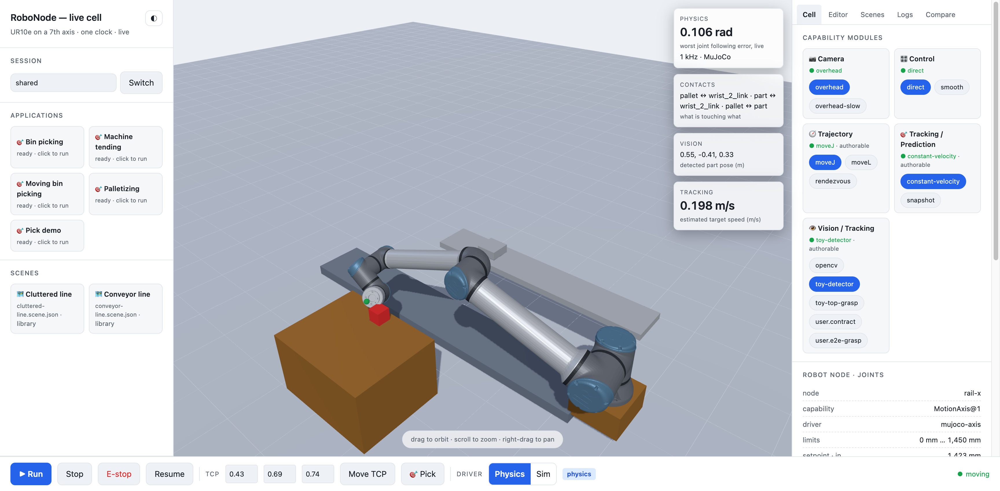
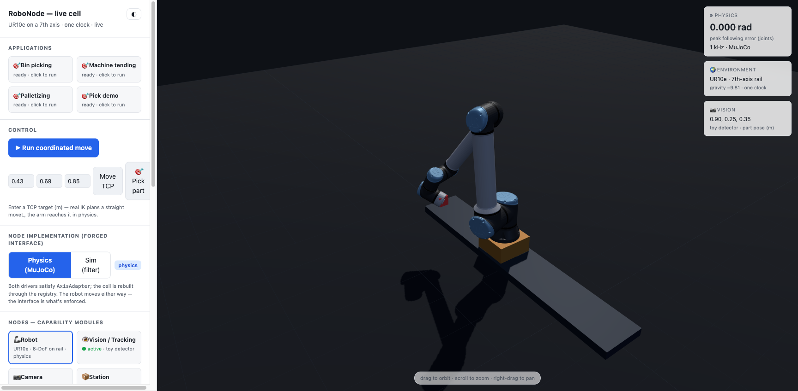
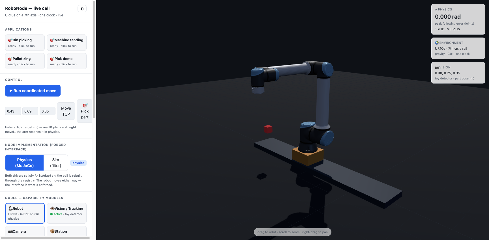

# RoboNode

[](https://github.com/brmel/robonode/actions/workflows/ci.yml)
[](LICENSE)
[](CHANGELOG.md)

## The goal

RoboNode sets out to give roboticists somewhere to test a robot and an algorithm
without setting anything up first. The goal is a hosted platform where the cell is
already waiting for you — robot arms, vision systems, grippers, conveyors, trajectory
planners and controllers — each one a module you can configure, swap for another
version, or replace outright with your own code. You bring the algorithm; the robot,
the physics and the tooling around them are already there, and nothing about trying an
idea should require a lab, a rig, or a week of setup.

More on how it came about: [ibraverse.ca/projects/robonode](https://ibraverse.ca/projects/robonode/).

RoboNode is also an experiment in what generative AI and agents can build. I wanted to
see how much of a real-time C++ platform an agent could carry, and the answer shaped the
repo: the executable gates described in [AGENTS.md](AGENTS.md) exist because autonomy
only works when the checks are machine-verifiable rather than trusted.

**An open-source platform for testing robotics algorithms in real physics.**

Swap the vision, the tracking, the trajectory or the control algorithm of a
running robot cell — from a browser, a CLI, or your own code — and watch what it
does to a UR10e on a rail in MuJoCo. The physics does not pretend: the arm is
stopped by what is in its way, a grasp is a constraint the model closes on the
part it actually caught, and a conveyor carries the workpiece by friction. When
an algorithm is wrong, it visibly fails, and the log says what it hit.

```sh
docker compose up --build      # → http://localhost:8080
```

Building from source instead: `scripts/setup.sh --deps` (or
`cmake --preset dev` for the fast loop — see
[CONTRIBUTING.md](CONTRIBUTING.md)).



*Mid-place. The **Contacts** card is reading the physics — `pallet ↔ wrist_2_link · part ↔ wrist_2_link` — and every card on the right is an algorithm you can swap while it runs.*

## What it looks like



*A grasp is a constraint the model closes on the part it actually caught — not an animation of a successful pick.*



*The same wire contract driving a real UR10e. The simulator is the safe half of the loop, not the whole of it.*

## Try it in five minutes

| | |
|---|---|
| **Run an application** | Click **Bin picking** in the left rail. Vision locates the part, the arm picks it, the pallet receives it. |
| **Break it on purpose** | Open the dock → **Cell**, switch Tracking to `snapshot`, run **Moving bin picking**. The arm now aims where the part *was*, and misses. The log says why. |
| **Write your own algorithm** | Dock → **Editor**. `x`, `y`, `z + 0.05` is a valid grasp offset. It compiles into a sandbox and becomes a selectable version. |
| **Change the world** | Dock → **Scenes**. Fork `cluttered-line`, move the crate, hit **Run scene**. The physics rebuilds around your JSON. |
| **Drive it headless** | `robonode --server http://localhost:8080 contacts` — what is touching what, right now. Every UI action has a CLI verb. |

## Why it exists

Robotics algorithms are usually evaluated in a paper, a notebook, or a
simulation that flatters them. This is a cell where an algorithm has to work:
one clean interface per capability (in the spirit of the Matrox Imaging
Library), mature engines underneath (MuJoCo, Ruckig, OpenCV, Pinocchio), and a
scenario that is honestly hard — the target is moving, the sensor is late, the
decoy is the same colour as the part.

Everything a user can change is **data**: the cell, the scene, the application,
the tuning. Everything a user can replace is **behind a seam we own**, so
swapping the planner does not touch the UI, the CLI, or the real-time loop.

## Contributing

Start with [CONTRIBUTING.md](CONTRIBUTING.md). The short version: `bash
scripts/verify.sh` must exit 0, and that is the whole bar. Issues labelled
**good first issue** are scoped to one file and one test. New algorithms and new
scenarios are the most useful things you can send.

- [SECURITY.md](SECURITY.md) — the platform runs code its users write; read this before hosting one publicly
- [docs/DEPLOYMENT.md](docs/DEPLOYMENT.md) — self-host, Fly.io, Cloud Run, and why serverless is the wrong shape for this
- [CODE_OF_CONDUCT.md](CODE_OF_CONDUCT.md)

## Documents

| Doc | What it is |
|---|---|
| [docs/ARCHITECTURE.md](docs/ARCHITECTURE.md) | **Architecture + stack in one file**: system map (components, nodes/versions, control flow), enforced principles, and every open-source building block we reuse (exact pins + the modularity seam each hides behind). The file to hand external reviewers. |
| [docs/DECISIONS.md](docs/DECISIONS.md) | ADR-1…15: reference hardware, data plane, sandbox, safety posture, RT-correctness, the one capability pattern, command identity, the node model, tuning-as-data, and what the software stop is *not* |
| [docs/CHALLENGES.md](docs/CHALLENGES.md) | **The scenarios the platform poses** — hard problems where the naive algorithm genuinely fails, and the one seam that fixes each |
| [docs/DEPLOYMENT.md](docs/DEPLOYMENT.md) | Running it: dev vs prod compose, the container topology, public instances, and the cloud options with their trade-offs |
| [docs/REAL-ROBOTS.md](docs/REAL-ROBOTS.md) | Real-robot kinematics via Robotics Toolbox behind our seams |
| [docs/TEST-STRATEGY.md](docs/TEST-STRATEGY.md) | Test layers (unit → integration → browser e2e) + the **scenario matrix** that flips → as the system grows — the visible progress metric |
| [docs/MODULE-MAP.md](docs/MODULE-MAP.md) | **Where a change belongs**: what each area owns, what it may depend on, which tests cover it, and the shortest loop that proves your change |
| [AGENTS.md](AGENTS.md) | **Autonomous operating manual** — the loop an unsupervised agent runs (pick → build → test → verify → record), the design-drift gates, and the tools (gh · ctest · Playwright · CLI · logging) |

Read order: **ARCHITECTURE** (what it is) → **DECISIONS** (why) → **MODULE-MAP** (where your change goes). The backlog is tracker.

## Real robots

Real robot kinematics from a mature library, behind our seams — no hand-rolled math. [petercorke/robotics-toolbox-python](https://github.com/petercorke/robotics-toolbox-python) (real models: UR3/5/10, Panda, …; validated FK/IK/Jacobian) runs as a small Python service ([services/rtb-kinematics/](services/rtb-kinematics/)); the C++ [engines/rtb/](engines/rtb/) implements the motion `Kinematics`/`Planner` seams against it. celld, the executive, and the adapters are unchanged. `scripts/rtb-verify.sh` plans a real UR10 Cartesian moveL end-to-end. Details + the real-physics-model plan: [docs/REAL-ROBOTS.md](docs/REAL-ROBOTS.md).

## Live web app (see it, drive it)

```sh
docker compose up --build          # → http://localhost:8080   (reproducible, no host toolchain)
# or locally:
cmake -B build && cmake --build build -j --target cell_server
./build/apps/cell_server/cell_server   # → http://localhost:8080
```

A 3D UR10e-on-a-rail you watch move in real time. The **left rail is your workspace** — session, applications, scenes; the **dock is the cell** — capability modules (swap any algorithm live), the robot's joints and their drivers, the scene editor, logs, and A/B compare. The dashboard reads live physics: worst joint following error, what vision sees, how fast the tracker thinks the target is moving, and **what is touching what**. **Run** streams a coordinated blended move from MuJoCo; the **Physics / Sim** toggle rebuilds every node through the `DriverRegistry` under a different driver — both satisfy `AxisAdapter`, so a node's implementation swaps live while the UI and motion code stay untouched (the forced interface). Transport is a thin HTTP+SSE gateway ([gateway/](gateway/), [apps/cell_server/](apps/cell_server/)); the roadmap Zenoh/gRPC surface swaps in behind the same `CellGateway` seam.

The physics is not decorative: the arm is stopped by fixtures and by the parts in its way, a grasp closes a weld on the part it actually caught, the belt carries the workpiece by friction, and letting go drops it ([ADR-16](docs/DECISIONS.md)).

## CLI at the heart (agent-complete, same code as the UI)

```sh
robonode --server http://localhost:8080 telemetry   # the cell you are watching
robonode --server http://localhost:8080 contacts    # what is touching what
robonode --server http://localhost:8080 logs        # the log ring, no stream
robonode --server http://localhost:8080 deliver conveyor-1 && robonode --server … pick
robonode --server http://localhost:8080 watch --for 20   # one line per change
```

**`--server` points the CLI at a running cell** instead of booting one in-process. Without it an agent debugging the robot on screen would be answering questions about a different robot — so every verb (reads, task steps, capability swaps, scene swaps) goes over the same HTTP contract the web app uses.

The `robonode` CLI (, [ADR-8](docs/DECISIONS.md)) is a **first-class surface, not an afterthought** — an agent drives the whole system headless: execute programs, swap modules, drive lifecycle, monitor state, tail logs/traces/telemetry, get feedback, all with `--json` machine output. The CLI and the web UI are **both thin clients of the one Platform facade** — the same contract, the same code path, no divergence; a capability in one surface but not the other is a bug. Built on [CLI11](https://github.com/CLIUtils/CLI11); logging is [spdlog](https://github.com/gabime/spdlog)/fmt structured + async (, [ADR-9](docs/DECISIONS.md)), with logs/traces/telemetry exposed as one followable stream both surfaces read.

## Autonomous development (launch an agent, walk away)

The repo is built to be worked by an agent unsupervised, start to finish ([AGENTS.md](AGENTS.md), [ADR-10](docs/DECISIONS.md)). Autonomy rests on **executable gates, not trust**:

```sh
scripts/verify.sh          # Definition of Done: design invariants + build + all C++ suites
scripts/verify.sh --e2e    #   … plus the browser journeys (docker + Playwright)
scripts/check-design.sh    # design-drift gate (CI): the ADRs as greppable rules — seams, RT purity, no hardcoding
```

An agent picks the next `agent-ready`, unblocked issue from the tracker, implements the thin slice, makes `verify.sh` pass, flips its row in the [scenario matrix](docs/TEST-STRATEGY.md), closes the issue with evidence, commits, and repeats — with `gh` (issues), `ctest` (unit/integration), Playwright (e2e + the MCP server for live checks), the `robonode` CLI (`--json`), and the observability stream as its hands. The gates catch drift so the human reviews closed issues instead of supervising steps.

## How the repository is laid out

```sh
cmake -B build && cmake --build build -j && ctest --test-dir build
bash scripts/verify.sh            # the definition of done: gates + build + every suite + smoke
bash scripts/verify.sh --e2e      # …plus the browser journeys
```

| Folder | What lives there |
|---|---|
| [core/](core/) | The vocabulary every other module speaks: state, limits, one error type, lifecycle verbs. Depends on nothing. |
| [motion/](motion/) | Turning a goal into movement — trajectory planning, blending, and the per-cycle safety gate every command passes through. |
| [celld/](celld/) | The cell as an object model: robots, tools, conveyors and pallets, all built from JSON descriptors rather than code. |
| [vision/](vision/) | What sees — detectors, the camera model, and the tracker that predicts where a moving part will be. |
| [sandbox/](sandbox/) | Where a stranger's algorithm runs: a compiler and a fuel-bounded VM with no access to the host. |
| [gateway/](gateway/) | The control plane. Owns the live cell, routes commands, publishes telemetry. Nothing depends on it. |
| [engines/](engines/) | The borrowed engines, each behind one of our interfaces: MuJoCo, OpenCV, Robotics Toolbox, Wasmtime. |
| [adapters/](adapters/) | Real hardware behind that same interface — today a UR wrist driven at 500 Hz. |
| [services/](services/) | Helpers that run out of process and are spoken to over HTTP. |
| [recorder/](recorder/) | Telemetry written to MCAP, openable in Foxglove. |
| [apps/](apps/) | The two things you actually run: the cell server and the `robonode` CLI. |
| [contracts/](contracts/) | The wire contract as JSON Schemas, validated against a live server. |
| [robonode-idl/](robonode-idl/) | A Protobuf sketch of a future gRPC surface. Nothing generates from it yet. |
| [config/](config/) | Every tunable as data, so changing behaviour does not mean changing code. |
| [examples/](examples/) | One runnable demo per interface. Not product surface. |
| [tests/](tests/) · [e2e/](e2e/) | Unit and integration tests; browser journeys and the contract tests. |
| [scripts/](scripts/) | The gates CI runs — `verify.sh` is the definition of done. |
| [docs/](docs/) | How it is designed and why. Start with [ARCHITECTURE.md](docs/ARCHITECTURE.md). |

The boundaries are enforced, not just described: [scripts/check-boundaries.sh](scripts/check-boundaries.sh) fails CI on any cross-module include — `core` depends on nothing, `recorder` never sees `motion`, and `trajlib` never escapes `motion/`.

## Status & next

**Now:** a cell you can drive from a browser, a CLI or an agent — real physics, swappable algorithms at every capability, user code in a sandbox, applications you deploy, and a control plane that can stop the robot. Every claim here is covered by `scripts/verify.sh` and the browser suite.

**Next**, in order (tracker has the full list): 6-DoF orientation (`Goal::kCartesianPose` still has no planner, the largest robotics gap), Pinocchio behind `Kinematics`, a planner that *avoids* the contacts the cell now reports, scene overrides and per-session cells.

OQ-1/2/4/5 decided ([DECISIONS](docs/DECISIONS.md)); OQ-3 (license) open.
