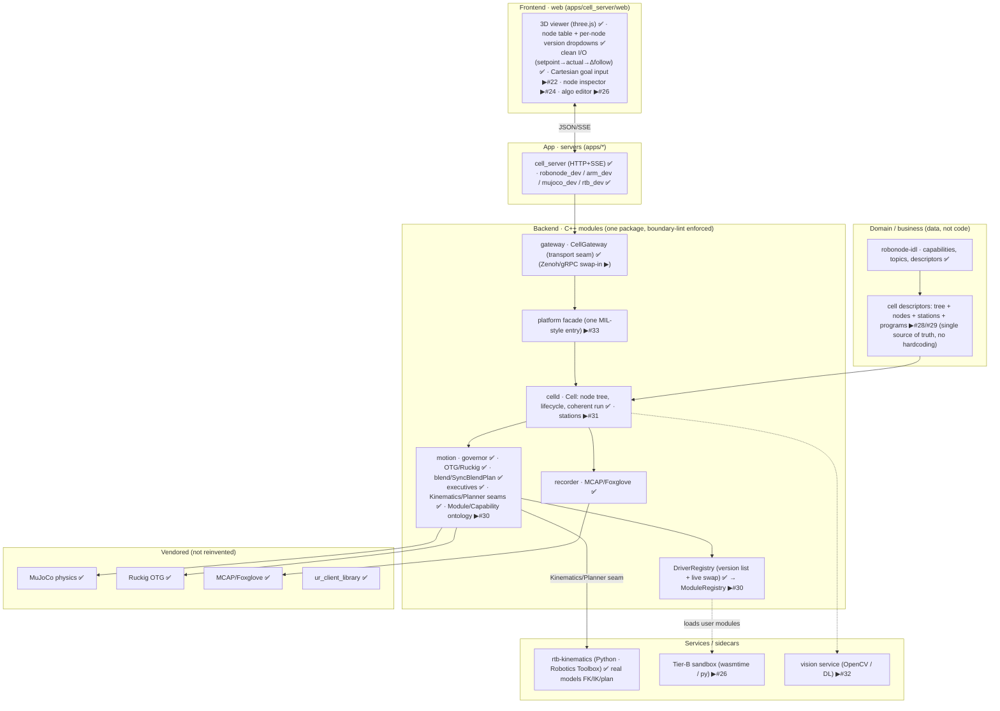
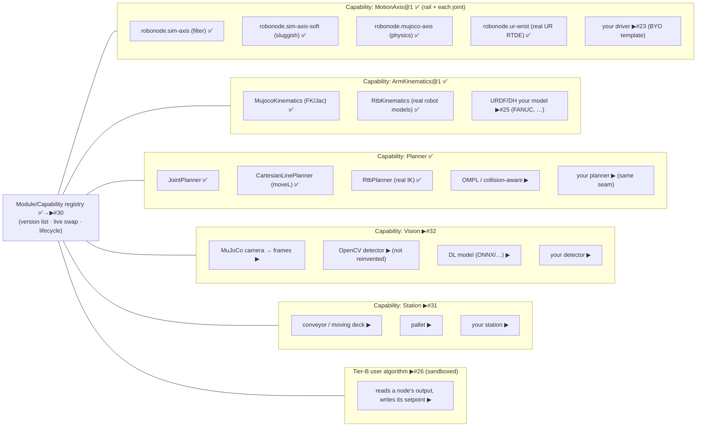
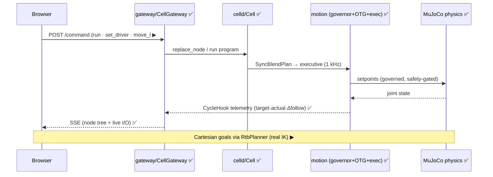

# RoboNode — system map

> High-level map of the platform: every component (web, app, backend, services, domain) and every node/module type with the versions a user can swap or author. ✅ implemented · ▶ planned (issue #). Vision: an open-source, modular platform where users see and manipulate robots + stations in real physics, and replace any module (path/trajectory, control, vision, …) with their own, tested quickly and safely — one clean interface hiding the complexity (Matrox-Imaging-Library-style).

## Components (layers)

## Nodes / modules and their versions (the registry)

Every node is a **Module** exposing a typed **Capability** with a clean I/O contract (in: setpoint/command · out: state/telemetry · lifecycle: configure/activate/deactivate). A user picks a version per node in the UI, or **authors their own** version satisfying the interface — it appears in the same dropdown.

## Control/telemetry flow (browser → physics → back)

## Principles (enforced)

- **One clean interface** hiding complexity — the Module/Capability seam (#30) + Platform facade (#33). MIL-style single ontology.
- **No hardcoded values / no duplication** — everything (tree, nodes, stations, limits, programs, ports, robot) is descriptor data (#28/#29), guarded by anti-hardcoding lint (#32).
- **Don't reinvent** — physics (MuJoCo), kinematics/models (Robotics Toolbox), OTG (Ruckig), vision (OpenCV/DL), telemetry (MCAP/Foxglove). Full catalog of reused/candidate open-source repos (incl. ROS 2, MoveIt, ros2_control, OpenCV, ONNX, vendor drivers): **[OSS-STACK.md](OSS-STACK.md)**.
- **Bring your own, safely** — any capability has a user-version slot; Tier-B runs user code sandboxed (#26); the governor is always the last safety net.
- **Structural modularity** — module boundaries enforced by `scripts/check-boundaries.sh` in CI; each module owns its dependency.
