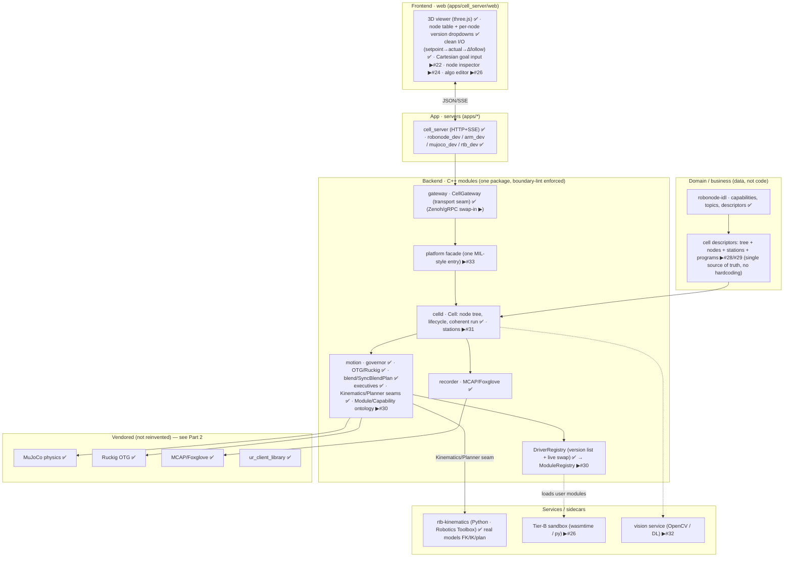
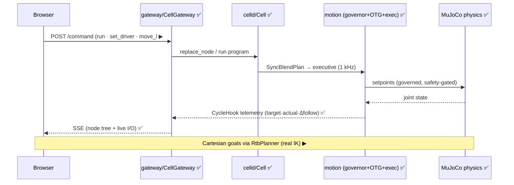

# RoboNode — architecture & stack (one file)

> **Goal.** An open-source, modular platform for testing robotics algorithms in a real physics environment. In a web app, users see and manipulate robots **and stations** (moving deck, pallet, conveyor) in a real physics engine, and swap or bring their own **module** — path/trajectory, robot control, vision, learning — behind **one clean interface that hides the complexity** (in the spirit of the Matrox Imaging Library). Every node is a typed capability with interchangeable versions and a bring-your-own slot, run safely in a sandbox. We **reuse mature engines** (MuJoCo, Robotics Toolbox, OpenCV/DL, Ruckig, MCAP/Foxglove) and never reinvent them; the platform is the clean, modular glue and the swap/test experience.
>
> *This file is the single source of truth for the system design + the open-source stack, written for external review (feed it to Codex/Gemini to critique).* Companion docs: [REQUIREMENTS.md](REQUIREMENTS.md) (FR-x), [SPEC.md](SPEC.md), [DECISIONS.md](DECISIONS.md) (ADRs), [ROADMAP-MODULARITY.md](ROADMAP-MODULARITY.md), [REAL-ROBOTS.md](REAL-ROBOTS.md).

---

# Part 1 — Architecture

## Components (layers)

## Nodes / modules and their versions (the registry)

Every node is a **Module** exposing a typed **Capability** with a clean I/O contract (in: setpoint/command · out: state/telemetry · lifecycle: configure/activate/deactivate). A user picks a version per node in the UI, or **authors their own** version satisfying the interface — it appears in the same dropdown.

## Control/telemetry flow (browser → physics → back)

## Principles (enforced)

- **One clean interface** hiding complexity — the Module/Capability seam (#30) + Platform facade (#33). MIL-style single ontology.
- **No hardcoded values / no duplication** — tree, nodes, stations, limits, programs, ports, robot are descriptor data (#28/#29), guarded by anti-hardcoding lint (#32).
- **Don't reinvent** — reuse the engines in Part 2.
- **Bring your own, safely** — every capability has a user-version slot; Tier-B runs user code sandboxed (#26); the governor is always the last safety net.
- **Structural modularity** — module boundaries enforced by `scripts/check-boundaries.sh` in CI; each module owns its dependency; **no dependency without a seam we own** (any Part-2 row is swappable without touching product logic).

---

# Part 2 — Stack (reuse, don't reinvent)

Mature open-source building blocks by concern. Status: ✅ used in the build now (with exact pin) · ▶ candidate (issue #) · ⏸ evaluated, set aside (trade-off noted). Written for external critique of the choices (esp. "why not ROS 2 / MoveIt?").

### Physics / simulation
| Repo | Role | Status / pin |
|---|---|---|
| [google-deepmind/mujoco](https://github.com/google-deepmind/mujoco) | Physics engine (the twin) | ✅ `3.10.0`, `sim-mujoco` (FetchContent, source build) |
| [google-deepmind/mujoco_menagerie](https://github.com/google-deepmind/mujoco_menagerie) | Real robot MJCF models (UR, Franka, Kuka, …) | ▶ #20 |
| [gazebosim/gz-sim](https://github.com/gazebosim/gz-sim) | Alt sim (Linux/CI twin) | ⏸ Jetty/gz-sim 11 (Ionic EOLs 2026-09 — don't pin); same `AxisAdapter` seam |
| [bulletphysics/bullet3](https://github.com/bulletphysics/bullet3) · [NVIDIA Isaac Sim](https://developer.nvidia.com/isaac/sim) | Alt physics / GPU sim + synthetic data | ⏸ later (perception RL) |

### Kinematics / dynamics / robotics toolboxes
| Repo | Role | Status / pin |
|---|---|---|
| [petercorke/robotics-toolbox-python](https://github.com/petercorke/robotics-toolbox-python) | Real robot models + FK/IK/Jacobian/trajectories | ✅ behind Kinematics/Planner seams (`rtb-kinematics` service) |
| [stack-of-tasks/pinocchio](https://github.com/stack-of-tasks/pinocchio) | Fast rigid-body dynamics/kinematics (C++) | ▶ candidate C++-native Kinematics impl |
| [robot-descriptions/robot_descriptions.py](https://github.com/robot-descriptions/robot_descriptions.py) | Fetch 185+ robot models (URDF/MJCF) ready | ▶ #21/#25 |
| [google-deepmind/dm_control](https://github.com/google-deepmind/dm_control) | MuJoCo Python control / PyMJCF | ⏸ reference |

### Motion planning / trajectory
| Repo | Role | Status / pin |
|---|---|---|
| [pantor/ruckig](https://github.com/pantor/ruckig) | Online jerk-limited trajectory (OTG) | ✅ `v0.17.3`, `motion` (community; waypoints are Pro/cloud — blending stays in-house) |
| [ompl/ompl](https://github.com/ompl/ompl) | Sampling-based motion planning (RRT/PRM) | ▶ collision-aware Planner impl |
| [moveit/moveit2](https://github.com/moveit/moveit2) | Full manipulation planning (ROS 2) | ⏸ **feedback-wanted** — heavy/ROS-coupled; we chose RTB + a Planner seam; OMPL is the lighter core |
| [hungpham2511/toppra](https://github.com/hungpham2511/toppra) | Time-optimal path parameterization | ▶ `v0.6.4` retiming reference (Python) |

### Robot control / drivers (real hardware)
| Repo | Role | Status / pin |
|---|---|---|
| [UniversalRobots/Universal_Robots_Client_Library](https://github.com/UniversalRobots/Universal_Robots_Client_Library) | UR RTDE/servoj control | ✅ `2.13.0`, `adapters/ur` (compile-verified; live needs x86 URSim) |
| [ros-controls/ros2_control](https://github.com/ros-controls/ros2_control) | Real-time controller framework | ⏸ **feedback-wanted** — our `AxisAdapter`+governor+executive cover it without ROS |
| [FANUC-CORPORATION/fanuc_description](https://github.com/FANUC-CORPORATION/fanuc_description) · [ros-industrial/fanuc](https://github.com/ros-industrial/fanuc) | FANUC URDF + meshes | ▶ #25 (via RTB URDF import — no ready MJCF exists) |
| [frankaemika/libfranka](https://github.com/frankaemika/libfranka) · [doosan-robotics/doosan-robot](https://github.com/doosan-robotics/doosan-robot) · [ros-industrial/abb](https://github.com/ros-industrial/abb) | Franka/Doosan/ABB drivers & descriptions | ▶ per-vendor adapters behind the seam |
| [IgH EtherLab](https://gitlab.com/etherlab.org/ethercat) | EtherCAT master (own drives) | ▶ `stable-1.6`; needs a Linux PREEMPT_RT rig |

### Vision / perception / learning (don't reinvent)
| Repo | Role | Status |
|---|---|---|
| [opencv/opencv](https://github.com/opencv/opencv) | Classical vision (detect, calib, track) | ▶ #6/#32 (Vision capability) |
| [microsoft/onnxruntime](https://github.com/microsoft/onnxruntime) | Run trained DL models (portable) | ▶ #32 (DL detector slot) |
| [pytorch/pytorch](https://github.com/pytorch/pytorch) · [ultralytics/ultralytics](https://github.com/ultralytics/ultralytics) | Training / detection (YOLO) | ▶ bring-your-own model |
| [NVlabs/FoundationPose](https://github.com/NVlabs/FoundationPose) · [google-ai-edge/mediapipe](https://github.com/google-ai-edge/mediapipe) | 6-DoF pose / perception blocks | ⏸ candidate detectors |

### Middleware / comms
| Repo | Role | Status / pin |
|---|---|---|
| [yhirose/cpp-httplib](https://github.com/yhirose/cpp-httplib) | HTTP+SSE gateway (v0 transport) | ✅ `v0.19.0`, `gateway` + `bridges/rtb` |
| [eclipse-zenoh/zenoh](https://github.com/eclipse-zenoh/zenoh) | Edge↔cloud pub/sub data plane | ▶ #7 (`zenoh-c`/`zenoh-cpp` 1.9.0) |
| [ros2/ros2](https://github.com/ros2/ros2) | Full robotics middleware + ecosystem | ⏸ **feedback-wanted** — chose Zenoh-native + our IDL; ROS 2 is bridged (rmw_zenoh), not the foundation |
| [grpc/grpc](https://github.com/grpc/grpc) | Typed RPC (SDKs/UI/Tier-B) | ⏸ #8 deferred (HTTP/SSE covers v0) |
| [nlohmann/json](https://github.com/nlohmann/json) | JSON (descriptors, gateway) | ✅ `v3.12.0` |

### Telemetry / visualization
| Repo | Role | Status / pin |
|---|---|---|
| [foxglove/mcap](https://github.com/foxglove/mcap) | Recording (flight recorder) | ✅ `releases/cpp/v2.1.3`, `recorder` (tarball fetch — git-lfs) |
| [foxglove/foxglove-sdk](https://github.com/foxglove/foxglove-sdk) | Live viz + MCAP (one API) | ▶ #11 (`sdk/v0.25.3`) |
| [mrdoob/three.js](https://github.com/mrdoob/three.js) · [gkjohnson/urdf-loaders](https://github.com/gkjohnson/urdf-loaders) | Web 3D twin | ✅ `r185` (vendored, no CDN) / ▶ real meshes |
| [rerun-io/rerun](https://github.com/rerun-io/rerun) | Multimodal viz | ⏸ alt |

### User-module sandbox (bring your own, safely) · fleet
| Repo | Role | Status |
|---|---|---|
| [bytecodealliance/wasmtime](https://github.com/bytecodealliance/wasmtime) | WASM runtime for user algorithms | ▶ #26 (`v46`; component-model-via-C-API is the unproven bet, WASI-p1 fallback) |
| OCI/containerd · [google/gvisor](https://github.com/google/gvisor) | Heavier/GPU user modules, isolation | ▶ Tier-B (containers) |
| [BehaviorTree/BehaviorTree.CPP](https://github.com/BehaviorTree/BehaviorTree.CPP) | Program/flow engine | ▶ `4.9.1` (under the flow UI) |
| [mendersoftware/mender](https://github.com/mendersoftware/mender) | A/B OTA updates | ▶ later (`5.1.0`) |

## Modularity seams (the contract layer — every Part-2 row hides behind one)

| Seam (we own) | Defined in | What plugs in behind it |
|---|---|---|
| `AxisAdapter` (MotionAxis) | `motion/.../axis_adapter.hpp` | sim · MuJoCo physics · UR · EtherCAT · your driver |
| `Kinematics` / `Planner` | `motion/.../kinematics.hpp`, `planner.hpp` | MuJoCo FK · Robotics Toolbox (real models) · OMPL · your planner |
| OTG slot | `motion/.../setpoint_source.hpp` | Ruckig · precomputed plans · Tier-C plugin |
| `DriverRegistry` → ModuleRegistry (#30) | `motion/.../driver_registry.hpp` | version list · live swap · lifecycle |
| Transport (`CellGateway`) | `gateway/` | HTTP+SSE now · Zenoh/gRPC later |
| Recorder | `recorder/` | raw MCAP · foxglove-sdk |
| Sandbox (Tier-B) | `CellClient` contract | wasmtime · OCI |
| Sim | `AxisAdapter` (sim adapter) | MuJoCo · Gazebo |

## Stance for reviewers (open question)

We built a **lean C++ core with clean seams** and reuse best-in-class engines behind them, rather than adopting the full **ROS 2 / MoveIt / ros2_control** stack up front — to avoid coupling the product API + node model to ROS distro cadence, keep the RT loop small and auditable, and let ROS be **bridged** (rmw_zenoh) for teams that want it. **Is the lean-core-with-bridges bet right, or should ROS 2 / MoveIt / ros2_control be first-class from the start?** Critiques welcome.

*Version-review cadence: re-run `git ls-remote --tags` at each milestone; watch zenoh 1.x→2.x, foxglove-sdk pre-1.0, wasmtime monthly majors (pin, don't track latest).*
