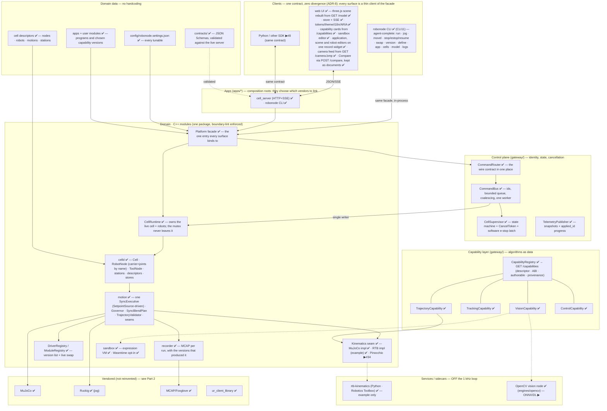
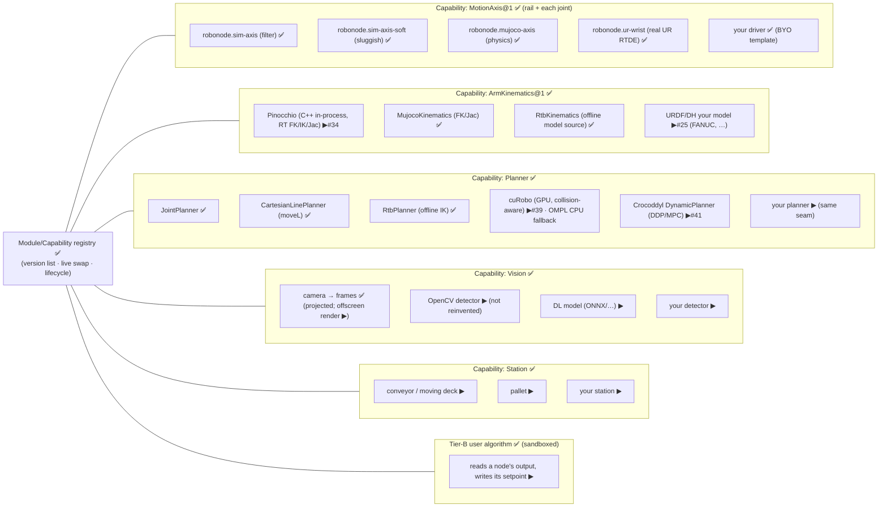
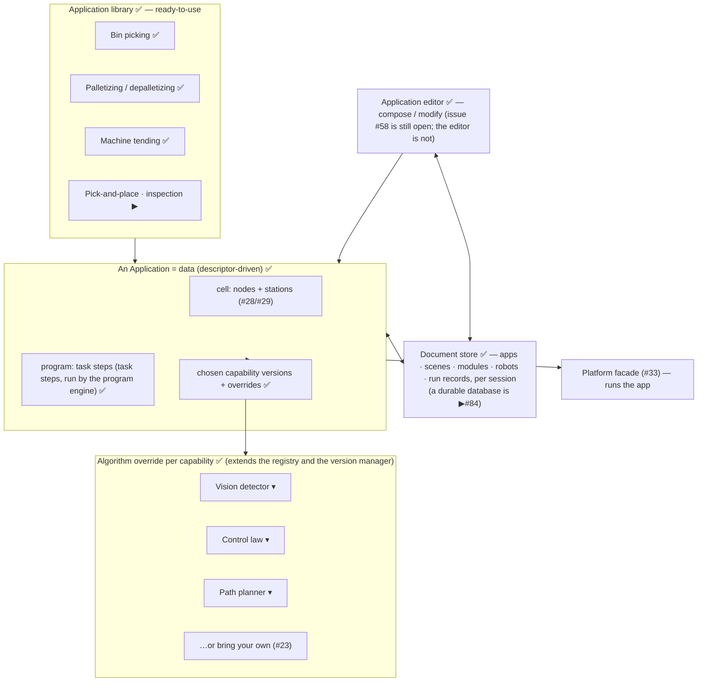
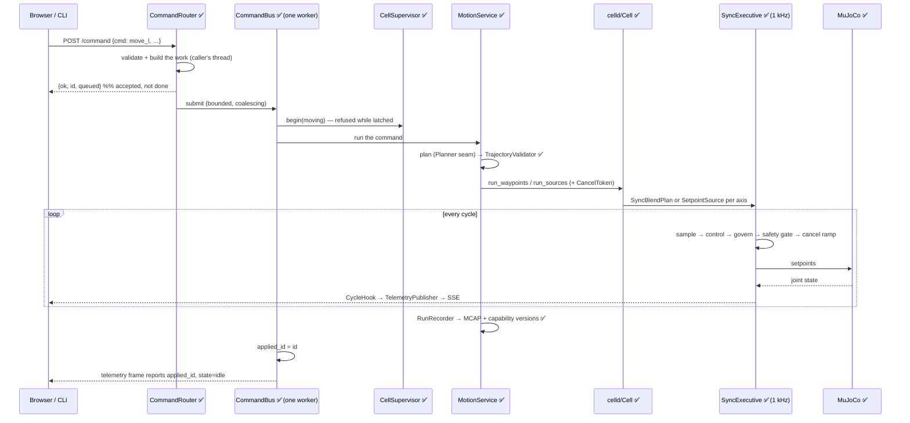

# RoboNode — architecture & stack (one file)

> **Goal.** An open-source, modular platform for testing robotics algorithms in a real physics environment. In a web app, users see and manipulate robots **and stations** (moving deck, pallet, conveyor) in a real physics engine, and swap or bring their own **module** — path/trajectory, robot control, vision, learning — behind **one clean interface that hides the complexity** (in the spirit of the Matrox Imaging Library). Every node is a typed capability with interchangeable versions and a bring-your-own slot, run safely in a sandbox. We **reuse mature engines** (MuJoCo, Robotics Toolbox, OpenCV/DL, Ruckig, MCAP/Foxglove) and never reinvent them; the platform is the clean, modular glue and the swap/test experience.
>
> *The single source of truth for the system design and the open-source stack.* Companion docs: [DECISIONS.md](DECISIONS.md) (the ADRs — why each choice), [MODULE-MAP.md](MODULE-MAP.md) (where a change belongs), [CHALLENGES.md](CHALLENGES.md) (the scenarios the platform poses), [DEPLOYMENT.md](DEPLOYMENT.md), [REAL-ROBOTS.md](REAL-ROBOTS.md). The backlog is tracker issue **#19**.

---

# Part 1 — Architecture

> This describes what is in the tree. A `▶#n` marks work that has not landed and
> names the issue tracking it; everything else is shipped and tested — the
> journey rows in [TEST-STRATEGY.md](TEST-STRATEGY.md) each name the test that
> proves them. For what changed when, see [CHANGELOG.md](../CHANGELOG.md); for
> the standing judgement on the boundaries, [SYSTEM-REVIEW.md](SYSTEM-REVIEW.md).
>
> A version number is not repeated here on purpose: it was stale within a week
> the last time it was.

## Components (layers)

`✅` in the tree · `▶#n` planned, tracked by that issue.



### Where a class lives, and why

| Layer | Owns | Key types |
|---|---|---|
| `core` | The vocabulary. Depends on nothing | `Status` `AxisState` `AxisLimits` `TelemetryRow` `CancelToken` `Settings` |
| `motion` | The 1 kHz spine and the seams it consumes | `SyncExecutive` `SetpointSource` (`PlanSource` `Otg` `HoldSource` `PlanAxisSource`) `Governor` `AxisAdapter` `Kinematics` `Planner` `Controller` `TrajectoryValidator` `ModuleRegistry` |
| `celld` | The cell as an object model | `Cell` `RobotNode` `ToolNode` `CellDescriptor` (nodes · robots · motions · stations) `SceneDescriptor` (objects · **overrides**) `JsonDocStore` |
| `sandbox` / `vision` | Untrusted code, and perception | `Compiler` `Program` · `Detector` `Camera` `CameraModel` `Tracker` |
| `gateway` | Composition: runtime, capabilities, control plane, transport contract | `Platform` `CellGateway` `CellRuntime` `MotionService` `ProgramRunner` `StationOps` `CapabilityRegistry` `CommandBus` `CommandRouter` `CellSupervisor` `TelemetryPublisher` `RunRecorder` `Workspace`/`Sessions` |
| `engines/*` | Vendor adapters behind a seam | `MujocoWorld` `MujocoAxisAdapter` `MujocoKinematics` `MjcfComposer` `RtbKinematics` `WasmDetector` |
| `apps/*` | Composition roots — choose the vendors to link | `cell_server` `robonode_cli` |

**Documents are one surface, five kinds.** `apps`, `scenes`, `modules`, `robots`
and `runs` are the same store with different contents: a shipped library,
whatever the session authored on top, and one rule per kind for whether a
document may be stored at all. Which kinds exist is `Workspace::kKinds` — the
HTTP routes and the shipped-library map build themselves from it, so adding one
is a row.

**The rule that keeps it honest:** a seam lives in the layer that *consumes* it.
The RT spine consumes `AxisAdapter`/`Controller`/`SetpointSource`/`Kinematics`,
so those live in `motion`. `Planner` and `Detector` are composed above, so they
live where the composition happens. Nothing depends on `gateway`.

## The swap stack — what a user can replace, and where

The platform's purpose is that **every layer of a robotics problem can be
changed independently**, so a scenario can be posed and a solution submitted
against one layer at a time. Read it bottom-up: each row is chosen as *data*
(a version name or a descriptor), never by editing the layer above.

| Layer | Seam | Selected by | Ships |
|---|---|---|---|
| **Scene** — the world, its objects, obstacles and what moves | MJCF + `CellDescriptor.world` · `Scene` | the cell descriptor (`world`, `stations`, `motions`) | `rail_ur10e.xml` — arm on a 7th axis, a driven conveyor, a workpiece, clutter |
| **Camera** — the sensor vision reads | `Camera` / `CameraRegistry` | `set_version camera …` | `overhead` · `overhead-slow` (8 fps, 350 ms latency, more noise) |
| **Vision** — finding the thing in the data | `Detector` | `set_version vision …` | `opencv` (real pixels) · `toy-detector` (scene oracle) · sandboxed · wasm |
| **Tracking** — where it will be | `Tracker` | `set_version tracking …` | `snapshot` (fails on purpose) · `constant-velocity` + gating · sandboxed |
| **Robot** — the machine and its chain | `RobotNode` + descriptor `robots` | the cell descriptor (carrier, joints, tcp) | UR10e on a rail |
| **Movement** — how it gets there | `Planner` | `set_version planner …` | `moveL` · `moveJ` · `rendezvous` (moving goals) · sandboxed |
| **Joint control** — what the servo is told, every cycle | `Controller` | `set_version control …` | `direct` · `smooth` — *not* authorable (ADR-5) |
| **Axis driver** — what a joint actually is | `AxisAdapter` | `set_driver <node> …` | MuJoCo physics · two sim models · UR hardware · bring-your-own |
| **Tool** — what holds the part | `ToolNode` | cell composition | `SimGripper` |

**The rule that keeps this honest:** a layer never constructs the layer below
it. A detector is *handed* a camera; a planner is *handed* kinematics; a cell is
*handed* its drivers. Where that rule was broken it was a real defect — the CV
detector used to build its own camera, so the sensor could not be changed
without editing the algorithm that read it.

### The physics is the referee

Contacts are on, and grouped by what a thing *is*:

| group | what | collides with |
|---|---|---|
| 1 | robot links | structure, parts |
| 2 | structure (floor, pallet, fixtures) | everything |
| 4 | parts (the workpiece, scene objects) | robot, structure, parts, belt |
| 8 | work surface (the belt) | parts only |
| 16 | the tool tip | structure |

Two rules earn their exceptions. The arm takes no contact from *itself* — a
control twin must not have a joint quietly held off target by its own elbow.
And the suction tip takes none from parts — a cup that shoved its target away
could never pick anything up. Everything else is a real contact, and a real
contact stops the arm.

A **grasp is a constraint**, not a fiction: the world declares a weld between
the wrist and the workpiece, and closing the tool activates it on the relative
pose the two bodies are in at that instant. The part then rides the tool because
the solver holds it there, and a release drops it. Nothing above `Scene` writes
a part's pose — `constrain`, `place_body` and `contacts` are the whole vocabulary.

The consequence is that the cell can now fail honestly: an obstacle blocks, a
mis-timed pick knocks the part away, a release over nothing drops it on the
floor. `contacts` is how it explains itself — in telemetry, on the dashboard,
in the log, and from the CLI.

### Scenes and sessions — how a user makes a scenario theirs

A **scene** is JSON: the world it starts from, plus the objects placed in it.

```json
{ "name": "Cluttered line", "base": "rail_ur10e.xml",
  "objects": [
    {"name": "crate",  "type": "box", "size": [0.10, 0.10, 0.12], "pos": [0.55, -0.05, 0.12],
     "collides": true, "mass": 8.0},
    {"name": "second_part", "size": [0.03, 0.03, 0.03], "pos": [1.30, 0.25, 0.37],
     "collides": false, "slide_axis": "-1 0 0", "slide_range": [-0.55, 0.55]}
  ] }
```

`MjcfComposer` builds the physics model from that — the only place that knows a
world is XML. Moving an obstacle is editing a number, not a tag. A scene with no
objects *is* its base world, so composing nothing costs nothing.

Switching scenario does not need a restart: `load_scene` goes through the
command bus, so it queues behind whatever is moving, recomposes the model,
rebuilds the cell and re-attaches kinematics, vision and the camera. A scene
that will not compose is refused and the running world is left alone.

A **session** is a workspace. Every user names one (`?session=alice`, the
`X-Robonode-Session` header, or `--session`) and gets their own scenes, apps and
algorithms. Reads fall back to the shipped library and writes always land in the
session, so:

- the library everyone starts from is read-only and cannot be broken;
- `fork` = copy a working scenario into your session and change it;
- your list shows both, tagged `origin: library` or `origin: session`.

### What is not swappable yet

- **The robot is descriptor-driven but has no catalogue.** Changing robot means
  writing a cell descriptor and a matching MJCF by hand; there is no library to
  pick from, and `joint_names()`/`tcp_site()` still read `robots.front()` rather
  than serving several robots at once.
- **A session shares one cell.** Scenes, apps and modules are per session, but
  the running physics cell is shared: two people cannot drive different
  scenarios at once. `CellManager` already runs N cells, so the missing piece is
  binding a cell to a session rather than to the platform.
- **Composition is additive.** A scene can place objects into a base world; it
  cannot yet move or remove what the base already contains.

## Nodes / modules and their versions (the registry)

Every node is a **Module** exposing a typed **Capability** with a clean I/O contract (in: setpoint/command · out: state/telemetry · lifecycle: configure/activate/deactivate). A user picks a version per node in the UI, or **authors their own** version satisfying the interface — it appears in the same dropdown.

**Node granularity — a node is a capability module, not a joint.** The user-facing nodes are the top-level modules: a **Robot** node (its kinematics + N internal joints), a **Camera** node, a **Vision/Tracking** node, a **Station** node (conveyor/deck/pallet). A joint (`MotionAxis`) is *internal to a Robot node*, surfaced in that node's inspector — it is **not** a top-level node. Accordingly the UI is a **dashboard** of these capability nodes (robot 3D · physics · environment · camera feed · per-node cards), never a bare joint/junction table.



## Application layer — ready-to-use apps you compose, modify, and override (Vention.io-style)

Above the nodes sits the **application layer**: an **Application** is a cell (nodes + stations) + a **program** (task steps) + the chosen capability versions — all data, run by the Platform facade. Users pick a ready app from a **library** (bin picking, palletizing, machine tending), **modify** it in an editor, **override** any algorithm (vision / control / path-planning) with another version or their own, and everything persists in a **database**. This is the MIL-style promise at the product level: ready value out of the box, full override underneath.



The app layer reuses everything below it: nodes/capabilities (#30), descriptor-driven cells + stations (#28/#29), the facade (#33), the CLI (#43), the dashboard (#46). An app is a *composition*, not new machinery — reuse mature engines, don't reinvent, converge to a Vention-class platform.

## Command + telemetry flow (a command, end to end)

Commands are **identified and asynchronous**: the reply means *accepted*, and
completion is observed on the stream when `applied_id` reaches that id. No
surface polls for a side effect, and no surface invents its own "done".



**Stopping.** `stop` ramps the executive's *path clock* to zero over
`motion.stop_time_s`, so the axes decelerate **along the planned path** rather
than stepping to a hold. `estop` does the same and **latches** the cell until
`resume`. Both act on the calling thread — a queue the worker is draining is
exactly the situation they exist for. This is a *software* stop and is
documented as such everywhere it appears; the safety function is hardware's
(SPEC I4).

## Non-functional targets

The numbers a change is measured against. Where a target is not yet evidenced,
it says so — an aspiration recorded as a fact is how a system lies about itself.

| | Target | Where it stands |
|---|---|---|
| NFR-1 | 1 kHz control cycle; jitter p99.9 < 100 µs on PREEMPT_RT | Measured per move and logged (`jitter p99 … max …`). Typical here: p99 ≈ 250 µs on a laptop under a general-purpose kernel. The PREEMPT_RT evidence is #16 |
| NFR-2 | Software stop observed → drive disable ≤ 10 ms | On-path deceleration lands within a cycle of the command; a *hardware* chain is independent and out of scope (ADR-15) |
| NFR-3 | Streaming command path ≤ 20 ms p99 | Commands are queued and identified; the streaming-into-a-running-move case is #51 |
| NFR-4 | Browser telemetry latency ≤ 150 ms p95 | SSE at the configured `stream_period_ms` (20 ms default) |
| NFR-5 | The cell runs with no cloud, indefinitely | True by construction: there is no cloud in the control path |
| NFR-9 | arm64 + x86_64 Linux, and macOS for development | Both built here; CI builds x86_64 |
| NFR-11 | Every public interface documented with a runnable example | Partly: the seams are documented, the CLI is self-describing, the contract is schema-validated |

## Principles (enforced)

- **One clean interface** hiding complexity — the Module/Capability seam (#30) + Platform facade (#33). MIL-style single ontology.
- **No hardcoded values / no duplication** — tree, nodes, stations, limits, programs, ports, robot are descriptor data (#28/#29), guarded by anti-hardcoding lint (#32).
- **Don't reinvent** — reuse the engines in Part 2.
- **Bring your own, safely** — every capability has a user-version slot; Tier-B runs user code sandboxed (#26); the governor is always the last safety net.
- **Structural modularity** — module boundaries enforced by `scripts/check-boundaries.sh` in CI; each module owns its dependency; **no dependency without a seam we own** (any Part-2 row is swappable without touching product logic).
- **Real-time correctness (external review, 2026-07)** — the 1 kHz path carries no Python, no heap allocation, no locks, no blocking I/O: kinematics run **in-process** (Pinocchio #34, not the Python RTB hop), the non-RT↔RT hand-off is a **lock-free SPSC** queue (#35), seams return **`std::expected`** not exceptions (#36), user modules are **AOT-compiled + WASI-off** (#37), and perception is **async-decoupled** off the loop (#38).
- **One contract, many surfaces (ADR-8).** The Platform facade is the single definition of *what the system can do*; the web UI, the `robonode` CLI and the SDK are thin clients of it, never a parallel implementation. The CLI is **agent-complete** — everything a human does in the UI, an agent does headless, with JSON output. The contract itself is written down in [`contracts/`](../contracts/) as JSON Schema and **validated against a running server**, so divergence fails a test instead of surprising a client. A capability in one surface but not another is a bug.
- **Nothing important is a literal.** Tuning lives in [`config/robonode.settings.json`](../config/robonode.settings.json) — IK damping/tolerance/budget, carrier weight, settle and stop windows, the trajectory-duration ceiling, approach clearance, queue capacity, stream rates, sandbox workspace bounds, recording. The cell (nodes, robots, motions, stations) and the applications are descriptor data. A heuristic you cannot change without a rebuild is one nobody will improve.
- **Failures are loud.** A fallback is legitimate only when the degraded behaviour is *correct*, not merely non-crashing: a missing detector refuses the pick instead of reporting the origin, a half-built cell reports which node failed and leaves the previous one running, and a rejected command is visible in the UI.
- **Observability is a shared stream (#44).** Logs, traces, and telemetry are one queryable, followable surface emitted through the recorder seam and consumed identically by CLI (`logs -f`, `trace`, `telemetry`) and UI. Logging uses a **mature, professional stack — spdlog + fmt**, structured (JSON sink), levelled, per-module, **async/lock-free so it never blocks the loop (#42)**. No `printf`/`iostream` in product code.

---

# Part 2 — Stack (reuse, don't reinvent)

Mature open-source building blocks by concern. Status: ✅ used in the build now (with exact pin) · ▶ candidate (issue #) · ⏸ evaluated, set aside (trade-off noted). Written for external critique of the choices (esp. "why not ROS 2 / MoveIt?").

### Physics / simulation
| Repo | Role | Status / pin |
|---|---|---|
| [google-deepmind/mujoco](https://github.com/google-deepmind/mujoco) | Physics engine (the twin) | ✅ `3.10.0`, `sim-mujoco` (FetchContent, source build) |
| [google-deepmind/mujoco_menagerie](https://github.com/google-deepmind/mujoco_menagerie) | Real robot MJCF models (UR, Franka, Kuka, …) | ▶ #20 |
| [gazebosim/gz-sim](https://github.com/gazebosim/gz-sim) | Alt sim (Linux/CI twin) | ⏸ Jetty/gz-sim 11 (Ionic EOLs 2026-09 — don't pin); same `AxisAdapter` seam |
| [bulletphysics/bullet3](https://github.com/bulletphysics/bullet3) · [NVIDIA Isaac Sim](https://developer.nvidia.com/isaac/sim) | Alt physics / GPU sim + synthetic data | ⏸ later (perception RL) |

### Kinematics / dynamics / robotics toolboxes
| Repo | Role | Status / pin |
|---|---|---|
| [stack-of-tasks/pinocchio](https://github.com/stack-of-tasks/pinocchio) | **RT** FK/IK/Jacobian in-process (C++, Eigen, analytic derivatives, µs) | ▶ **#34 P0 — the RT Kinematics impl** (review: kill the Python-in-loop hop) |
| [petercorke/robotics-toolbox-python](https://github.com/petercorke/robotics-toolbox-python) | Robot models + offline FK/IK/trajectories | ✅ behind the Kinematics seam, **offline / Tier-C only — not in the 1 kHz loop** (`rtb-kinematics` service) |
| [robot-descriptions/robot_descriptions.py](https://github.com/robot-descriptions/robot_descriptions.py) | Fetch 185+ robot models (URDF/MJCF) ready | ▶ #21/#25 |
| [google-deepmind/dm_control](https://github.com/google-deepmind/dm_control) | MuJoCo Python control / PyMJCF | ⏸ reference |

### Motion planning / trajectory
| Repo | Role | Status / pin |
|---|---|---|
| [pantor/ruckig](https://github.com/pantor/ruckig) | Online jerk-limited trajectory (OTG) | ✅ `v0.17.3`, `motion` (community; waypoints are Pro/cloud — blending stays in-house) |
| [NVlabs/curobo](https://github.com/NVlabs/curobo) | GPU-parallel global planning + collision (CUDA) | ▶ **#39** — Planner impl; review benches ~45 ms vs OMPL ~1 s |
| [ompl/ompl](https://github.com/ompl/ompl) | Sampling-based motion planning (RRT/PRM) | ▶ CPU-fallback Planner impl (#39) |
| [loco-3d/crocoddyl](https://github.com/loco-3d/crocoddyl) | Optimal control / DDP (built on Pinocchio) | ▶ #41 — DynamicPlanner capability, contact-rich, later |
| [moveit/moveit2](https://github.com/moveit/moveit2) | Full manipulation planning (ROS 2) | ⏸ **review confirms skip** — heavy/ROS-coupled; Pinocchio + cuRobo/OMPL behind our Planner seam is the lean path |
| [hungpham2511/toppra](https://github.com/hungpham2511/toppra) | Time-optimal path parameterization | ▶ `v0.6.4` retiming reference (Python) |

### Robot control / drivers (real hardware)
| Repo | Role | Status / pin |
|---|---|---|
| [UniversalRobots/Universal_Robots_Client_Library](https://github.com/UniversalRobots/Universal_Robots_Client_Library) | UR RTDE/servoj control | ✅ `2.13.0`, `adapters/ur` (compile-verified; live needs x86 URSim) |
| [ros-controls/ros2_control](https://github.com/ros-controls/ros2_control) | Real-time controller framework | ⏸ **feedback-wanted** — our `AxisAdapter`+governor+executive cover it without ROS |
| [FANUC-CORPORATION/fanuc_description](https://github.com/FANUC-CORPORATION/fanuc_description) · [ros-industrial/fanuc](https://github.com/ros-industrial/fanuc) | FANUC URDF + meshes | ▶ #25 (via RTB URDF import — no ready MJCF exists) |
| [frankaemika/libfranka](https://github.com/frankaemika/libfranka) · [doosan-robotics/doosan-robot](https://github.com/doosan-robotics/doosan-robot) · [ros-industrial/abb](https://github.com/ros-industrial/abb) | Franka/Doosan/ABB drivers & descriptions | ▶ per-vendor adapters behind the seam |
| [IgH EtherLab](https://gitlab.com/etherlab.org/ethercat) | EtherCAT master (own drives) | ▶ `stable-1.6`; needs a Linux PREEMPT_RT rig |

### Vision / perception / learning (don't reinvent) — **async-decoupled, never in the 1 kHz loop** (#38)
Perception runs in its own thread pool; poses cross to the loop via SPSC and a state estimator (EKF) interpolates the low-rate result up to loop rate.
| Repo | Role | Status |
|---|---|---|
| [opencv/opencv](https://github.com/opencv/opencv) | Classical vision (detect, calib, track) | ▶ #6 (Vision capability) |
| [microsoft/onnxruntime](https://github.com/microsoft/onnxruntime) | Run trained DL models (portable) | ▶ #6 (DL detector slot) |
| [halide/Halide](https://github.com/halide/Halide) | High-perf image kernels (algorithm/schedule split, ARM64) | ▶ #38 custom vision-node option (review) |
| [pytorch/pytorch](https://github.com/pytorch/pytorch) · [ultralytics/ultralytics](https://github.com/ultralytics/ultralytics) | Training / detection (YOLO) | ▶ bring-your-own model |
| [NVlabs/FoundationPose](https://github.com/NVlabs/FoundationPose) · [google-ai-edge/mediapipe](https://github.com/google-ai-edge/mediapipe) | 6-DoF pose / perception blocks | ⏸ candidate detectors |

### Middleware / comms
| Repo | Role | Status / pin |
|---|---|---|
| [yhirose/cpp-httplib](https://github.com/yhirose/cpp-httplib) | HTTP+SSE gateway (v0 transport) | ✅ `v0.19.0`, `gateway` + `engines/rtb` |
| [eclipse-zenoh/zenoh](https://github.com/eclipse-zenoh/zenoh) | Edge↔cloud pub/sub data plane (+ `zenoh-shm` zero-copy for vision) | ▶ #7 (`zenoh-c`/`zenoh-cpp` 1.9.0); review: use shm transport for frames |
| [ros2/ros2](https://github.com/ros2/ros2) | Full robotics middleware + ecosystem | ⏸ **review confirms bridge-not-foundation** — Zenoh-native + our IDL; ROS 2 attaches via rmw_zenoh |
| [eclipse-ecal/ecal](https://github.com/eclipse-ecal/ecal) | Pure-C++ zero-copy shared-memory transport | ⏸ alt to Zenoh for vision shm if the zenoh-c bindings prove cumbersome (review) |
| [grpc/grpc](https://github.com/grpc/grpc) | Typed RPC (SDKs/UI/Tier-B) | ⏸ #8 deferred (HTTP/SSE covers v0) |
| [nlohmann/json](https://github.com/nlohmann/json) | JSON (descriptors, gateway) — **authoring only** | ✅ `v3.12.0` (RT-loop reads move to FlatBuffers, #40) |

### Real-time plumbing (external review — keep the 1 kHz path clean)
| Repo | Role | Status / pin |
|---|---|---|
| [boostorg/lockfree](https://github.com/boostorg/lockfree) | Lock-free SPSC queue — non-RT↔RT command/telemetry hand-off | ▶ **#35** (review: no mutex/alloc/blocking in the loop; don't hand-roll) |
| [TartanLlama/expected](https://github.com/TartanLlama/expected) | `std::expected` shim (pre-C++23) for seam error returns | ▶ #36 (review: expected over exceptions across seams — RT/ABI safety) |
| [google/flatbuffers](https://github.com/google/flatbuffers) | Zero-copy descriptor reads inside the RT loop | ▶ #40 (JSON stays for authoring; FlatBuffers for in-loop config) |
| [gabime/spdlog](https://github.com/gabime/spdlog) · [fmtlib/fmt](https://github.com/fmtlib/fmt) | **Logging backbone** — structured (JSON sink), levelled, per-module, async/lock-free | ▶ #42 (RT-loop no-block) + **#44** (structured logs + one CLI/UI observability surface) |

### Telemetry / visualization
| Repo | Role | Status / pin |
|---|---|---|
| [foxglove/mcap](https://github.com/foxglove/mcap) | Recording (flight recorder) | ✅ `releases/cpp/v2.1.3`, `recorder` (tarball fetch — git-lfs) |
| [foxglove/foxglove-sdk](https://github.com/foxglove/foxglove-sdk) | Live viz + MCAP (one API) | ▶ #11 (`sdk/v0.25.3`) |
| [mrdoob/three.js](https://github.com/mrdoob/three.js) · [gkjohnson/urdf-loaders](https://github.com/gkjohnson/urdf-loaders) | Web 3D twin | ✅ `r185` (vendored, no CDN) / ▶ real meshes |
| [rerun-io/rerun](https://github.com/rerun-io/rerun) | Multimodal viz | ⏸ alt |

### Client / CLI — agent-complete, same contract as the UI (#43)
The `robonode` CLI and the web UI are both thin clients of the Platform facade (#33): identical command + telemetry contract, no divergent logic. The CLI exists so an **agent can drive the whole system headless** — execute, monitor, tail logs/traces/telemetry, manage lifecycle — with machine-readable output.
| Repo | Role | Status / pin |
|---|---|---|
| [CLIUtils/CLI11](https://github.com/CLIUtils/CLI11) | C++ command/subcommand parsing for `robonode` | ▶ #43 (mature, header-only; subcommands, validators, config) |
| [nlohmann/json](https://github.com/nlohmann/json) | `--json` machine output (same schema the UI/SSE speak) | ✅ reused |
| SSE / Zenoh stream | `logs -f` · `trace` · `telemetry` follow — same stream the UI subscribes to | ▶ #43/#44 |

### User-module sandbox (bring your own, safely) · fleet
| Repo | Role | Status |
|---|---|---|
| [bytecodealliance/wasmtime](https://github.com/bytecodealliance/wasmtime) | WASM runtime for user algorithms (Tier-B) | ▶ #26/#37 (`v46`; review: **AOT/Cranelift precompile + WASI disabled** for in-loop modules — no JIT warmup, no OS calls; component-model-via-C-API remains the unproven bet, WASI-p1 fallback). Tier-A bare-metal drivers/planners use a dlopen C-ABI `.so`/`.dylib` slot instead (#37). |
| OCI/containerd · [google/gvisor](https://github.com/google/gvisor) | Heavier/GPU user modules, isolation | ▶ Tier-B (containers) |
| [BehaviorTree/BehaviorTree.CPP](https://github.com/BehaviorTree/BehaviorTree.CPP) | Program/flow engine | ▶ `4.9.1` (under the flow UI) |
| [mendersoftware/mender](https://github.com/mendersoftware/mender) | A/B OTA updates | ▶ later (`5.1.0`) |

## Modularity seams (the contract layer — every Part-2 row hides behind one)

A seam is only real if something else already plugs into it. `✅` = ≥2
implementations selectable as data today.

| Seam (we own) | Defined in | What plugs in behind it |
|---|---|---|
| `AxisAdapter` ✅ | `motion/axis_adapter.hpp` | `SimAxis` · `SimAxis`(soft) · `ByoAxis` · `MujocoAxisAdapter` · `UrWristAdapter` · your driver |
| `SetpointSource` ✅ | `motion/setpoint_source.hpp` | `PlanSource` · `Otg` (Ruckig) · `HoldSource` · `PlanAxisSource` · a teleop feed |
| `Kinematics` ✅ | `motion/kinematics.hpp` | `MujocoKinematics` · `RtbKinematics` (example) · Pinocchio ▶#34 |
| `Planner` ✅ | `motion/planner.hpp` | `CartesianLinePlanner` (moveL) · `JointReachPlanner` (moveJ) · `RendezvousPlanner` · `SandboxedPlanner` (user code) · collision-aware cuRobo/OMPL ▶#39 |
| `Controller` ✅ | `motion/controller.hpp` | `DirectController` · `SmoothController` |
| `Detector` ✅ | `vision/detector.hpp` | `ToyDetector` (scene oracle) · **`CvDetector` (OpenCV, real pixels)** · `SandboxedDetector` · `WasmDetector` |
| `Camera` ✅ | `vision/camera.hpp` · `camera_registry.hpp` | `robonode.overhead` · `robonode.overhead-slow`; a rendered or real camera plugs in unchanged. Detectors are handed one — they never build it |
| `Tracker` ✅ | `vision/tracker.hpp` | `SnapshotTracker` (no motion model — the honest baseline) · `ConstantVelocityTracker` (least squares + track gating) · `SandboxedTracker` (user code) |
| `Scene` ✅ | `celld/scene.hpp` | `MujocoScene` — the LIVE world a station drives and a sensor reads |
| `ToolNode` | `celld/tool_node.hpp` | `SimGripper` · a real gripper driver |
| `ModuleRegistry<T,Ctx>` ✅ | `motion/module_registry.hpp` | one "list versions / build one / swap live" mechanism for **every** capability |
| `CapabilityBase` ✅ | `gateway/capability.hpp` | vision · trajectory · control — each self-describing to every surface |
| `CellGateway::DriverHook` ✅ | `gateway/cell_gateway.hpp` | the app chooses which vendor drivers exist in this build |
| Persistence ✅ | `celld/json_doc_store.hpp` | filesystem now (per session) · a durable store ▶#84, same interface |
| Transport | `apps/cell_server` + `contracts/` | HTTP+SSE now · gRPC/Zenoh ▶#8 |
| Recorder ✅ | `recorder/` | MCAP (Foxglove-readable) |
| Sandbox ✅ | `sandbox/program.hpp` | expression VM · Wasmtime (opt-in) |

## External review → decisions (2026-07)

Two independent deep-reviews of this file validated the lean-core-over-ROS 2 bet
— stay lean, bridge ROS via rmw_zenoh — and converged on the same real-time
hardening. The findings became ADRs and issues; **the ones still open are still
open**, and the table says which.

| Review finding | Decision | Issue |
|---|---|---|
| Python RTB in the 1 kHz loop = IPC + GIL jitter, blows the deadline | **Pinocchio (C++) does RT FK/IK/Jac in-process**; RTB demoted to offline model source / Tier-C | #34 (P0) |
| Mutex on the non-RT↔RT boundary = priority inversion | **Lock-free SPSC** (vendored boost::lockfree), no lock/alloc/blocking in the loop | #35 (P0) |
| Exceptions across seams break RT-safety + ABI | **`std::expected`** (tl::expected pre-C++23) on seam returns; RT path stays noexcept + latched | #36 |
| Wasm JIT warmup (15–30 ms) + WASI syscalls break determinism | **Wasmtime AOT/Cranelift + WASI-off** for in-loop modules; native C-ABI `.so` slot for Tier-A | #37 |
| DL inference (15–100 ms) cannot sit in the loop | **Vision async-decoupled**: own thread pool → SPSC → EKF interpolation; zenoh-shm zero-copy frames | #38 |
| OMPL global planning ~1 s, jagged paths | **cuRobo (GPU)** behind the Planner seam (~45 ms), OMPL CPU fallback | #39 |
| JSON parse allocates → RT spikes | **FlatBuffers** for in-loop descriptor reads; JSON stays for authoring | #40 |
| Contact-rich optimal control wanted | **Crocoddyl** DynamicPlanner (DDP on Pinocchio), later | #41 |
| Blocking I/O logging in the loop | **spdlog/fmt async** logging | #42 |
| MuJoCo · Ruckig · Zenoh · Wasmtime · MCAP choices | **Confirmed** — keep pinned | — |

The seam design is what lets every one of these land **without touching product logic**: Pinocchio slots behind the same `Kinematics` interface RTB uses; cuRobo behind the same `Planner`; the SPSC behind the `CellGateway` transport. That is the modularity paying rent.

*Version-review cadence: re-run `git ls-remote --tags` at each milestone; watch zenoh 1.x→2.x, foxglove-sdk pre-1.0, wasmtime monthly majors (pin, don't track latest).*
