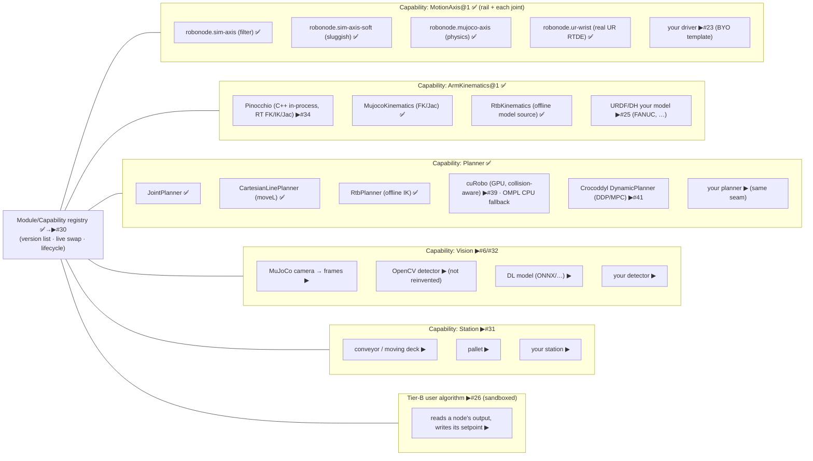

# RoboNode — architecture & stack (one file)

> **Goal.** An open-source, modular platform for testing robotics algorithms in a real physics environment. In a web app, users see and manipulate robots **and stations** (moving deck, pallet, conveyor) in a real physics engine, and swap or bring their own **module** — path/trajectory, robot control, vision, learning — behind **one clean interface that hides the complexity** (in the spirit of the Matrox Imaging Library). Every node is a typed capability with interchangeable versions and a bring-your-own slot, run safely in a sandbox. We **reuse mature engines** (MuJoCo, Robotics Toolbox, OpenCV/DL, Ruckig, MCAP/Foxglove) and never reinvent them; the platform is the clean, modular glue and the swap/test experience.
>
> *This file is the single source of truth for the system design + the open-source stack, written for external review (feed it to Codex/Gemini to critique).* Companion docs: [REQUIREMENTS.md](REQUIREMENTS.md) (FR-x), [SPEC.md](SPEC.md), [DECISIONS.md](DECISIONS.md) (ADRs), [ROADMAP-MODULARITY.md](ROADMAP-MODULARITY.md), [REAL-ROBOTS.md](REAL-ROBOTS.md).

---

# Part 1 — Architecture

## Components (layers)

```mermaid
flowchart TB
  subgraph FE["Clients — one contract, zero divergence (#43): every surface is a thin client of the facade, no surface owns logic the others lack"]
    UI["web UI (three.js) ✅ · node table · clean I/O ✅ · goals ▶#22 · inspector ▶#24 · algo editor ▶#26"]
    CLI["robonode CLI (CLI11) ▶#43 — **agent-complete**: run · swap · monitor · logs -f · trace · telemetry · lifecycle · --json machine output"]
    SDK["Python / other SDK ▶#8 (same contract)"]
  end
  subgraph APP["App · servers (apps/*)"]
    SRV["cell_server (HTTP+SSE) ✅ · robonode_dev / arm_dev / mujoco_dev / rtb_dev ✅"]
  end
  subgraph BE["Backend · C++ modules (one package, boundary-lint enforced)"]
    GW["gateway · CellGateway (transport seam) ✅ (Zenoh/gRPC swap-in ▶)"]
    FACADE["platform facade (one MIL-style entry) ▶#33"]
    CELLD["celld · Cell: node tree, lifecycle, coherent run ✅ · stations ▶#31"]
    MOTION["motion · governor ✅ · OTG/Ruckig ✅ · blend/SyncBlendPlan ✅<br/>executives ✅ · Kinematics/Planner seams ✅ · Module/Capability ontology ▶#30"]
    PINO["kinematics · Pinocchio (C++, in-process FK/IK/Jac) ▶#34<br/>RT path — replaces the Python hop"]
    REG["DriverRegistry (version list + live swap) ✅ → ModuleRegistry ▶#30"]
    REC["recorder · MCAP/Foxglove ✅"]
  end
  subgraph SVC["Services / sidecars — OFF the 1 kHz loop"]
    RTB["rtb-kinematics (Python · Robotics Toolbox) ✅<br/>offline model source + Tier-C planning — never in the RT loop"]
    SAND["Tier-B sandbox (wasmtime AOT/Cranelift, WASI-off) ▶#26/#37"]
    VIS["vision (OpenCV / ONNX-DL) — async-decoupled ▶#6/#38"]
  end
  subgraph DEP["Vendored (not reinvented) — see Part 2"]
    MJ["MuJoCo physics ✅"] ; RUCK["Ruckig OTG ✅"] ; MCAP["MCAP/Foxglove ✅"] ; URCL["ur_client_library ✅"]
  end
  subgraph DOMAIN["Domain / business (data, not code)"]
    IDL["robonode-idl · capabilities, topics, descriptors ✅"]
    DESC["cell descriptors: tree + nodes + stations + programs ▶#28/#29 (single source of truth, no hardcoding)"]
  end

  UI <-->|JSON/SSE| SRV
  CLI <-->|same commands + streams · --json ▶#43| SRV
  SDK <-->|same contract| SRV
  SRV --> GW
  GW -->|lock-free SPSC ▶#35 · non-RT→RT boundary| FACADE
  FACADE --> CELLD --> MOTION --> REG
  CELLD --> REC
  REC -->|logs · traces · telemetry, one stream ▶#44| SRV
  MOTION -->|Kinematics seam · in-process, no IPC| PINO
  PINO -.->|offline model import (URDF)| RTB
  REG -.->|loads user modules| SAND
  CELLD -.->|async, SPSC — never blocks the loop| VIS
  MOTION --> MJ ; MOTION --> RUCK ; REC --> MCAP
  DESC --> CELLD ; IDL --> DESC
```

## Nodes / modules and their versions (the registry)

Every node is a **Module** exposing a typed **Capability** with a clean I/O contract (in: setpoint/command · out: state/telemetry · lifecycle: configure/activate/deactivate). A user picks a version per node in the UI, or **authors their own** version satisfying the interface — it appears in the same dropdown.



## Control/telemetry flow (browser → physics → back)

```mermaid
sequenceDiagram
  participant U as Browser
  participant G as gateway/CellGateway ✅
  participant C as celld/Cell ✅
  participant M as motion (governor+OTG+exec) ✅
  participant P as MuJoCo physics ✅
  U->>G: POST /command (run · set_driver · move_l ▶#22)
  G->>C: enqueue on lock-free SPSC ▶#35 (non-RT→RT, no mutex)
  C->>M: SyncBlendPlan → executive (1 kHz)
  M->>M: Pinocchio FK/IK/Jac in-process ▶#34 (no Python hop)
  M->>P: setpoints (governed, safety-gated)
  P-->>M: joint state
  M-->>G: telemetry via SPSC → CycleHook (target·actual·Δfollow) ✅
  G-->>U: SSE (node tree + live I/O) ✅
  Note over U,P: RTB serves models offline; cuRobo plans collision-free ▶#39 · Tier-B algo AOT-sandboxed ▶#26/#37
```

## Principles (enforced)

- **One clean interface** hiding complexity — the Module/Capability seam (#30) + Platform facade (#33). MIL-style single ontology.
- **No hardcoded values / no duplication** — tree, nodes, stations, limits, programs, ports, robot are descriptor data (#28/#29), guarded by anti-hardcoding lint (#32).
- **Don't reinvent** — reuse the engines in Part 2.
- **Bring your own, safely** — every capability has a user-version slot; Tier-B runs user code sandboxed (#26); the governor is always the last safety net.
- **Structural modularity** — module boundaries enforced by `scripts/check-boundaries.sh` in CI; each module owns its dependency; **no dependency without a seam we own** (any Part-2 row is swappable without touching product logic).
- **Real-time correctness (external review, 2026-07)** — the 1 kHz path carries no Python, no heap allocation, no locks, no blocking I/O: kinematics run **in-process** (Pinocchio #34, not the Python RTB hop), the non-RT↔RT hand-off is a **lock-free SPSC** queue (#35), seams return **`std::expected`** not exceptions (#36), user modules are **AOT-compiled + WASI-off** (#37), and perception is **async-decoupled** off the loop (#38).
- **One contract, many surfaces — CLI is first-class (#43).** The Platform facade (#33) is the single definition of *what the system can do*; the **web UI, the `robonode` CLI, and the SDK are all thin clients of it — sharing the exact same code path, never a parallel implementation.** The CLI is **agent-complete**: everything a human does in the UI, an agent does headless via the CLI — execute actions, swap modules, run programs, monitor state, tail logs/traces/telemetry, drive lifecycle — with `--json` machine output. A capability that exists in one surface but not the other is a bug. Built on a mature CLI library (CLI11), not hand-rolled arg parsing.
- **Observability is a shared stream (#44).** Logs, traces, and telemetry are one queryable, followable surface emitted through the recorder seam and consumed identically by CLI (`logs -f`, `trace`, `telemetry`) and UI. Logging uses a **mature, professional stack — spdlog + fmt**, structured (JSON sink), levelled, per-module, **async/lock-free so it never blocks the loop (#42)**. No `printf`/`iostream` in product code.

---

# Part 2 — Stack (reuse, don't reinvent)

Mature open-source building blocks by concern. Status: ✅ used in the build now (with exact pin) · ▶ candidate (issue #) · ⏸ evaluated, set aside (trade-off noted). Written for external critique of the choices (esp. "why not ROS 2 / MoveIt?").

### Physics / simulation
| Repo | Role | Status / pin |
|---|---|---|
| [google-deepmind/mujoco](https://github.com/google-deepmind/mujoco) | Physics engine (the twin) | ✅ `3.10.0`, `sim-mujoco` (FetchContent, source build) |
| [google-deepmind/mujoco_menagerie](https://github.com/google-deepmind/mujoco_menagerie) | Real robot MJCF models (UR, Franka, Kuka, …) | ▶ #20 |
| [gazebosim/gz-sim](https://github.com/gazebosim/gz-sim) | Alt sim (Linux/CI twin) | ⏸ Jetty/gz-sim 11 (Ionic EOLs 2026-09 — don't pin); same `AxisAdapter` seam |
| [bulletphysics/bullet3](https://github.com/bulletphysics/bullet3) · [NVIDIA Isaac Sim](https://developer.nvidia.com/isaac/sim) | Alt physics / GPU sim + synthetic data | ⏸ later (perception RL) |

### Kinematics / dynamics / robotics toolboxes
| Repo | Role | Status / pin |
|---|---|---|
| [stack-of-tasks/pinocchio](https://github.com/stack-of-tasks/pinocchio) | **RT** FK/IK/Jacobian in-process (C++, Eigen, analytic derivatives, µs) | ▶ **#34 P0 — the RT Kinematics impl** (review: kill the Python-in-loop hop) |
| [petercorke/robotics-toolbox-python](https://github.com/petercorke/robotics-toolbox-python) | Robot models + offline FK/IK/trajectories | ✅ behind the Kinematics seam, **offline / Tier-C only — not in the 1 kHz loop** (`rtb-kinematics` service) |
| [robot-descriptions/robot_descriptions.py](https://github.com/robot-descriptions/robot_descriptions.py) | Fetch 185+ robot models (URDF/MJCF) ready | ▶ #21/#25 |
| [google-deepmind/dm_control](https://github.com/google-deepmind/dm_control) | MuJoCo Python control / PyMJCF | ⏸ reference |

### Motion planning / trajectory
| Repo | Role | Status / pin |
|---|---|---|
| [pantor/ruckig](https://github.com/pantor/ruckig) | Online jerk-limited trajectory (OTG) | ✅ `v0.17.3`, `motion` (community; waypoints are Pro/cloud — blending stays in-house) |
| [NVlabs/curobo](https://github.com/NVlabs/curobo) | GPU-parallel global planning + collision (CUDA) | ▶ **#39** — Planner impl; review benches ~45 ms vs OMPL ~1 s |
| [ompl/ompl](https://github.com/ompl/ompl) | Sampling-based motion planning (RRT/PRM) | ▶ CPU-fallback Planner impl (#39) |
| [loco-3d/crocoddyl](https://github.com/loco-3d/crocoddyl) | Optimal control / DDP (built on Pinocchio) | ▶ #41 — DynamicPlanner capability, contact-rich, later |
| [moveit/moveit2](https://github.com/moveit/moveit2) | Full manipulation planning (ROS 2) | ⏸ **review confirms skip** — heavy/ROS-coupled; Pinocchio + cuRobo/OMPL behind our Planner seam is the lean path |
| [hungpham2511/toppra](https://github.com/hungpham2511/toppra) | Time-optimal path parameterization | ▶ `v0.6.4` retiming reference (Python) |

### Robot control / drivers (real hardware)
| Repo | Role | Status / pin |
|---|---|---|
| [UniversalRobots/Universal_Robots_Client_Library](https://github.com/UniversalRobots/Universal_Robots_Client_Library) | UR RTDE/servoj control | ✅ `2.13.0`, `adapters/ur` (compile-verified; live needs x86 URSim) |
| [ros-controls/ros2_control](https://github.com/ros-controls/ros2_control) | Real-time controller framework | ⏸ **feedback-wanted** — our `AxisAdapter`+governor+executive cover it without ROS |
| [FANUC-CORPORATION/fanuc_description](https://github.com/FANUC-CORPORATION/fanuc_description) · [ros-industrial/fanuc](https://github.com/ros-industrial/fanuc) | FANUC URDF + meshes | ▶ #25 (via RTB URDF import — no ready MJCF exists) |
| [frankaemika/libfranka](https://github.com/frankaemika/libfranka) · [doosan-robotics/doosan-robot](https://github.com/doosan-robotics/doosan-robot) · [ros-industrial/abb](https://github.com/ros-industrial/abb) | Franka/Doosan/ABB drivers & descriptions | ▶ per-vendor adapters behind the seam |
| [IgH EtherLab](https://gitlab.com/etherlab.org/ethercat) | EtherCAT master (own drives) | ▶ `stable-1.6`; needs a Linux PREEMPT_RT rig |

### Vision / perception / learning (don't reinvent) — **async-decoupled, never in the 1 kHz loop** (#38)
Perception runs in its own thread pool; poses cross to the loop via SPSC and a state estimator (EKF) interpolates the low-rate result up to loop rate.
| Repo | Role | Status |
|---|---|---|
| [opencv/opencv](https://github.com/opencv/opencv) | Classical vision (detect, calib, track) | ▶ #6 (Vision capability) |
| [microsoft/onnxruntime](https://github.com/microsoft/onnxruntime) | Run trained DL models (portable) | ▶ #6 (DL detector slot) |
| [halide/Halide](https://github.com/halide/Halide) | High-perf image kernels (algorithm/schedule split, ARM64) | ▶ #38 custom vision-node option (review) |
| [pytorch/pytorch](https://github.com/pytorch/pytorch) · [ultralytics/ultralytics](https://github.com/ultralytics/ultralytics) | Training / detection (YOLO) | ▶ bring-your-own model |
| [NVlabs/FoundationPose](https://github.com/NVlabs/FoundationPose) · [google-ai-edge/mediapipe](https://github.com/google-ai-edge/mediapipe) | 6-DoF pose / perception blocks | ⏸ candidate detectors |

### Middleware / comms
| Repo | Role | Status / pin |
|---|---|---|
| [yhirose/cpp-httplib](https://github.com/yhirose/cpp-httplib) | HTTP+SSE gateway (v0 transport) | ✅ `v0.19.0`, `gateway` + `bridges/rtb` |
| [eclipse-zenoh/zenoh](https://github.com/eclipse-zenoh/zenoh) | Edge↔cloud pub/sub data plane (+ `zenoh-shm` zero-copy for vision) | ▶ #7 (`zenoh-c`/`zenoh-cpp` 1.9.0); review: use shm transport for frames |
| [ros2/ros2](https://github.com/ros2/ros2) | Full robotics middleware + ecosystem | ⏸ **review confirms bridge-not-foundation** — Zenoh-native + our IDL; ROS 2 attaches via rmw_zenoh |
| [eclipse-ecal/ecal](https://github.com/eclipse-ecal/ecal) | Pure-C++ zero-copy shared-memory transport | ⏸ alt to Zenoh for vision shm if the zenoh-c bindings prove cumbersome (review) |
| [grpc/grpc](https://github.com/grpc/grpc) | Typed RPC (SDKs/UI/Tier-B) | ⏸ #8 deferred (HTTP/SSE covers v0) |
| [nlohmann/json](https://github.com/nlohmann/json) | JSON (descriptors, gateway) — **authoring only** | ✅ `v3.12.0` (RT-loop reads move to FlatBuffers, #40) |

### Real-time plumbing (external review — keep the 1 kHz path clean)
| Repo | Role | Status / pin |
|---|---|---|
| [boostorg/lockfree](https://github.com/boostorg/lockfree) | Lock-free SPSC queue — non-RT↔RT command/telemetry hand-off | ▶ **#35** (review: no mutex/alloc/blocking in the loop; don't hand-roll) |
| [TartanLlama/expected](https://github.com/TartanLlama/expected) | `std::expected` shim (pre-C++23) for seam error returns | ▶ #36 (review: expected over exceptions across seams — RT/ABI safety) |
| [google/flatbuffers](https://github.com/google/flatbuffers) | Zero-copy descriptor reads inside the RT loop | ▶ #40 (JSON stays for authoring; FlatBuffers for in-loop config) |
| [gabime/spdlog](https://github.com/gabime/spdlog) · [fmtlib/fmt](https://github.com/fmtlib/fmt) | **Logging backbone** — structured (JSON sink), levelled, per-module, async/lock-free | ▶ #42 (RT-loop no-block) + **#44** (structured logs + one CLI/UI observability surface) |

### Telemetry / visualization
| Repo | Role | Status / pin |
|---|---|---|
| [foxglove/mcap](https://github.com/foxglove/mcap) | Recording (flight recorder) | ✅ `releases/cpp/v2.1.3`, `recorder` (tarball fetch — git-lfs) |
| [foxglove/foxglove-sdk](https://github.com/foxglove/foxglove-sdk) | Live viz + MCAP (one API) | ▶ #11 (`sdk/v0.25.3`) |
| [mrdoob/three.js](https://github.com/mrdoob/three.js) · [gkjohnson/urdf-loaders](https://github.com/gkjohnson/urdf-loaders) | Web 3D twin | ✅ `r185` (vendored, no CDN) / ▶ real meshes |
| [rerun-io/rerun](https://github.com/rerun-io/rerun) | Multimodal viz | ⏸ alt |

### Client / CLI — agent-complete, same contract as the UI (#43)
The `robonode` CLI and the web UI are both thin clients of the Platform facade (#33): identical command + telemetry contract, no divergent logic. The CLI exists so an **agent can drive the whole system headless** — execute, monitor, tail logs/traces/telemetry, manage lifecycle — with machine-readable output.
| Repo | Role | Status / pin |
|---|---|---|
| [CLIUtils/CLI11](https://github.com/CLIUtils/CLI11) | C++ command/subcommand parsing for `robonode` | ▶ #43 (mature, header-only; subcommands, validators, config) |
| [nlohmann/json](https://github.com/nlohmann/json) | `--json` machine output (same schema the UI/SSE speak) | ✅ reused |
| SSE / Zenoh stream | `logs -f` · `trace` · `telemetry` follow — same stream the UI subscribes to | ▶ #43/#44 |

### User-module sandbox (bring your own, safely) · fleet
| Repo | Role | Status |
|---|---|---|
| [bytecodealliance/wasmtime](https://github.com/bytecodealliance/wasmtime) | WASM runtime for user algorithms (Tier-B) | ▶ #26/#37 (`v46`; review: **AOT/Cranelift precompile + WASI disabled** for in-loop modules — no JIT warmup, no OS calls; component-model-via-C-API remains the unproven bet, WASI-p1 fallback). Tier-A bare-metal drivers/planners use a dlopen C-ABI `.so`/`.dylib` slot instead (#37). |
| OCI/containerd · [google/gvisor](https://github.com/google/gvisor) | Heavier/GPU user modules, isolation | ▶ Tier-B (containers) |
| [BehaviorTree/BehaviorTree.CPP](https://github.com/BehaviorTree/BehaviorTree.CPP) | Program/flow engine | ▶ `4.9.1` (under the flow UI) |
| [mendersoftware/mender](https://github.com/mendersoftware/mender) | A/B OTA updates | ▶ later (`5.1.0`) |

## Modularity seams (the contract layer — every Part-2 row hides behind one)

| Seam (we own) | Defined in | What plugs in behind it |
|---|---|---|
| `AxisAdapter` (MotionAxis) | `motion/.../axis_adapter.hpp` | sim · MuJoCo physics · UR · EtherCAT · your driver |
| `Kinematics` / `Planner` | `motion/.../kinematics.hpp`, `planner.hpp` | MuJoCo FK · Robotics Toolbox (real models) · OMPL · your planner |
| OTG slot | `motion/.../setpoint_source.hpp` | Ruckig · precomputed plans · Tier-C plugin |
| `DriverRegistry` → ModuleRegistry (#30) | `motion/.../driver_registry.hpp` | version list · live swap · lifecycle |
| Transport (`CellGateway`) | `gateway/` | HTTP+SSE now · Zenoh/gRPC later |
| Recorder | `recorder/` | raw MCAP · foxglove-sdk |
| Sandbox (Tier-B) | `CellClient` contract | wasmtime · OCI |
| Sim | `AxisAdapter` (sim adapter) | MuJoCo · Gazebo |

## External review → decisions (2026-07)

Two independent Gemini deep-reviews of this file. Both **validate the lean-core-over-ROS 2 bet** — stay lean, bridge ROS via rmw_zenoh — and converge on the same real-time hardening. (A third review, ChatGPT, returned generic cloud-backend advice — K8s, Redis, Kafka, OAuth — unrelated to a 1 kHz C++ controller; discarded.) Each finding → our decision → issue:

| Review finding | Decision | Issue |
|---|---|---|
| Python RTB in the 1 kHz loop = IPC + GIL jitter, blows the deadline | **Pinocchio (C++) does RT FK/IK/Jac in-process**; RTB demoted to offline model source / Tier-C | #34 (P0) |
| Mutex on the non-RT↔RT boundary = priority inversion | **Lock-free SPSC** (vendored boost::lockfree), no lock/alloc/blocking in the loop | #35 (P0) |
| Exceptions across seams break RT-safety + ABI | **`std::expected`** (tl::expected pre-C++23) on seam returns; RT path stays noexcept + latched | #36 |
| Wasm JIT warmup (15–30 ms) + WASI syscalls break determinism | **Wasmtime AOT/Cranelift + WASI-off** for in-loop modules; native C-ABI `.so` slot for Tier-A | #37 |
| DL inference (15–100 ms) cannot sit in the loop | **Vision async-decoupled**: own thread pool → SPSC → EKF interpolation; zenoh-shm zero-copy frames | #38 |
| OMPL global planning ~1 s, jagged paths | **cuRobo (GPU)** behind the Planner seam (~45 ms), OMPL CPU fallback | #39 |
| JSON parse allocates → RT spikes | **FlatBuffers** for in-loop descriptor reads; JSON stays for authoring | #40 |
| Contact-rich optimal control wanted | **Crocoddyl** DynamicPlanner (DDP on Pinocchio), later | #41 |
| Blocking I/O logging in the loop | **spdlog/fmt async** logging | #42 |
| MuJoCo · Ruckig · Zenoh · Wasmtime · MCAP choices | **Confirmed** — keep pinned | — |

The seam design is what lets every one of these land **without touching product logic**: Pinocchio slots behind the same `Kinematics` interface RTB uses; cuRobo behind the same `Planner`; the SPSC behind the `CellGateway` transport. That is the modularity paying rent.

*Version-review cadence: re-run `git ls-remote --tags` at each milestone; watch zenoh 1.x→2.x, foxglove-sdk pre-1.0, wasmtime monthly majors (pin, don't track latest).*
