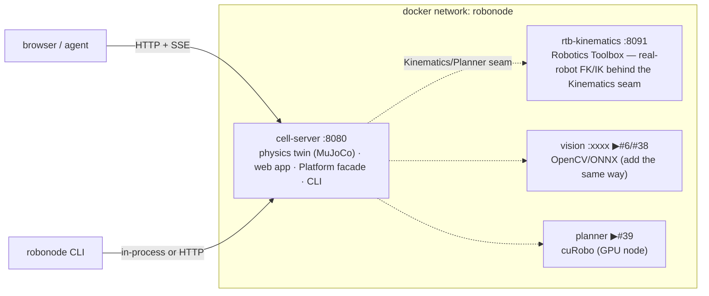

# Deployment — modular containers

> One capability, one container, one seam. The platform deploys as independent services on a shared network; the seam we own is the boundary, the container is the unit of deploy and scale. Add a capability = add a service, no core change.

## Topology



## Run it

```sh
docker compose up --build        # → http://localhost:8080
docker compose ps                # health of each service
docker compose logs -f cell-server
docker compose down
```

| Service | Image | Port | Role | Health |
|---|---|---|---|---|
| `cell-server` | `robonode/cell-server` | 8080 | physics twin + web + facade | `GET /` |
| `rtb-kinematics` | `robonode/rtb-kinematics` | 8091 | real-robot kinematics (RTB) | `GET /health` |

Each has `restart: unless-stopped` and a healthcheck; they share the `robonode` network and reach each other by service name (`rtb-kinematics:8091`).

## Build model

`cell-server` is a **multi-stage** build: an Ubuntu toolchain stage compiles the package (MuJoCo from source, UR adapter off), the runtime stage keeps only `libstdc++6` + the built tree (the binary's RPATH to `libmujoco` stays valid because `/src` is copied to the same path). `rtb-kinematics` is a slim Python image that `pip install`s the mature library — never reimplemented.

## Adding a capability service (the pattern)

1. Put the capability behind its seam in the C++ core (or as a sidecar, like RTB).
2. Give it a `Dockerfile` + a healthcheck.
3. Add a service block to `docker-compose.yml` on the `robonode` network.
4. The cell-server reaches it by name; nothing else changes — that is the modularity paying rent.

This is how the vision service (#6/#38), the GPU planner (cuRobo, #39), Zenoh (#7), and the Tier-B sandbox (#26/#37) attach: each a container behind a seam the core already owns.

## Notes

- **GPU services** (cuRobo #39) run on a GPU host with the NVIDIA container runtime (`deploy.resources.reservations.devices`) — not on a laptop.
- **Real hardware** (UR / EtherCAT, #15/#16) runs the cell-server on an x86 PREEMPT_RT host with the fieldbus on the metal, not in a container.
- The web assets and cell descriptor are baked into the image; override at runtime with `ROBONODE_WEB_DIR`, `ROBONODE_WORLDS_DIR`, `ROBONODE_CELL_FILE`.
