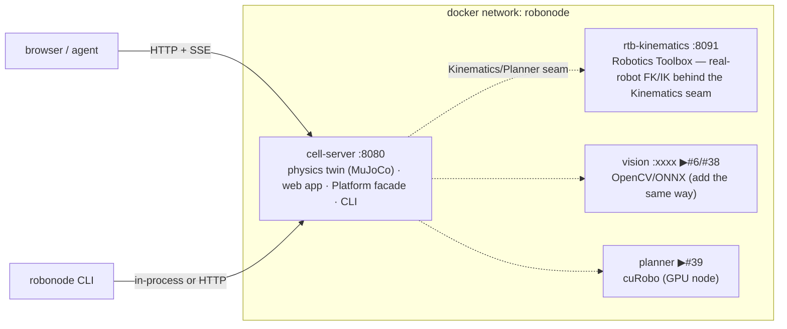

# Deployment — modular containers

> One capability, one container, one seam. The platform deploys as independent services on a shared network; the seam we own is the boundary, the container is the unit of deploy and scale. Add a capability = add a service, no core change.

## Topology



## Run it — dev and prod are two files, not two flags

```sh
docker compose up --build                    # DEV: web, cells, apps, scenes and
                                             # config live from source; edit and
                                             # restart, no rebuild
docker compose -f docker-compose.yml up -d   # PROD: image only, nothing mounted,
                                             # state in a named volume
docker compose ps                            # health of each service
docker compose logs -f cell-server
docker compose down
```

`docker-compose.yml` is the immutable definition. `docker-compose.override.yml`
holds the developer conveniences and compose loads it automatically — which is
why the dev path is the short command and production is the explicit one.

| Service | Image | Port | Role | Health |
|---|---|---|---|---|
| `cell-server` | `robonode/cell-server` | 8080 | physics twin + web + facade | `GET /` |
| `rtb-kinematics` | `robonode/rtb-kinematics` | 8091 | real-robot kinematics (RTB) | `GET /health` |

Each has `restart: unless-stopped` and a healthcheck; they share the `robonode` network and reach each other by service name (`rtb-kinematics:8091`).

## Build model

`cell-server` is a **multi-stage** build: an Ubuntu toolchain stage compiles the package (MuJoCo from source, UR adapter off), the runtime stage keeps only `libstdc++6` + the built tree (the binary's RPATH to `libmujoco` stays valid because `/src` is copied to the same path). `rtb-kinematics` is a slim Python image that `pip install`s the mature library — never reimplemented.

## What the application is, and what that rules out

`cell-server` is **one stateful, CPU-bound process**: a physics world that must
keep stepping (a conveyor runs whether or not the robot does), long-lived SSE
connections, and files on disk for sessions, scenes and user modules. It is not
a request/response function.

That rules some things out immediately:

- **Serverless functions** (Firebase Functions, Lambda) cannot host it: no
  long-lived process, no C++ binary, no streaming worth the name.
- **Static hosting** (Firebase Hosting, Pages, Netlify) can serve the web app,
  but the web app is a thin client — without a cell there is nothing to drive.
  Hosting can sit *in front of* a container, which is the only sense in which
  "deploy it to Firebase" means anything.
- **Scale-to-zero** container platforms kill a running cell mid-scenario. Use
  them only with a minimum instance kept warm.

What it needs: **a container that stays up, one dedicated CPU, and a writable
volume.**

## Adding a capability service (the pattern)

1. Put the capability behind its seam in the C++ core (or as a sidecar, like RTB).
2. Give it a `Dockerfile` + a healthcheck.
3. Add a service block to `docker-compose.yml` on the `robonode` network.
4. The cell-server reaches it by name; nothing else changes — that is the modularity paying rent.

This is how the vision service (#6/#38), the GPU planner (cuRobo, #39), Zenoh (#7), and the Tier-B sandbox (#26/#37) attach: each a container behind a seam the core already owns.

## Public instances

Read [SECURITY.md](../SECURITY.md) first — the server ships no authentication,
and it runs code its users write.

- **`ROBONODE_PUBLIC=1`.** A visitor can still fork a scene, author an algorithm
  and run it; what it refuses is deleting someone else's session and spawning
  cells (a physics cell is a CPU, so "add ten" is a denial of service).
- **TLS and a rate limit at the edge.** Fly and Cloud Run give you TLS; the rate
  limit is yours to add. The physics loop is the workload.
- **A disk quota** on the sessions volume: sessions, scenes and modules are
  files any visitor can create.
- **Not as root**, and no host path you care about mounted into the container.

## Somewhere other than your laptop

### 1. Your own machine (the default)

`docker compose up` — see above. This is also the right answer for a lab
machine or a workstation next to a real robot.

### 2. Fly.io — one command, stays up, has a volume

```sh
fly launch --copy-config --no-deploy   # reads fly.toml
fly volumes create robonode_data --size 1
fly deploy
```

`fly.toml` in the repo root already sets what matters:

| Setting | Why |
|---|---|
| `min_machines_running = 1`, `auto_stop_machines = false` | a physics cell must not scale to zero |
| `size = "performance-1x"` | a *dedicated* vCPU; shared CPUs make the 1 kHz loop jitter |
| volume at `/data`, sessions and modules pointed there | authored work survives a restart |
| `ROBONODE_PUBLIC = "1"` | destructive verbs refused on a public address (SECURITY.md) |

Cost is a few dollars a month for one always-on machine. Render and Railway work
the same way (Dockerfile + persistent disk + "don't sleep"); the settings above
translate directly.

### 3. Cloud Run (and Firebase Hosting in front of it, if you want that)

Cloud Run will host the container, with two caveats that cost real money and
real thought:

```sh
gcloud run deploy robonode-cell \
  --source . --region europe-west1 \
  --cpu 1 --memory 2Gi --min-instances 1 --no-cpu-throttling \
  --set-env-vars ROBONODE_HOST=0.0.0.0,ROBONODE_PUBLIC=1
```

- `--min-instances 1 --no-cpu-throttling` is **not optional**. Without it the
  instance sleeps between requests and the physics stops advancing — a conveyor
  that only moves while someone is watching is not a simulation.
- The filesystem is ephemeral. Sessions and user modules vanish on every
  instance replacement. Mount a GCS bucket (`--add-volume`,
  `--add-volume-mount`) or accept that the instance is a scratchpad. A proper
  database-backed store is the open roadmap item (#84) behind `JsonDocStore`.

To put **Firebase Hosting** in front of it — a CDN, a custom domain, and the
same origin so SSE and the wire contract are untouched:

```jsonc
// firebase.json
{
  "hosting": {
    "public": "apps/cell_server/web",
    "ignore": ["**/.*"],
    "rewrites": [
      { "source": "/command",      "run": { "serviceId": "robonode-cell", "region": "europe-west1" } },
      { "source": "/events",       "run": { "serviceId": "robonode-cell", "region": "europe-west1" } },
      { "source": "/telemetry",    "run": { "serviceId": "robonode-cell", "region": "europe-west1" } },
      { "source": "/nodes",        "run": { "serviceId": "robonode-cell", "region": "europe-west1" } },
      { "source": "/logs",         "run": { "serviceId": "robonode-cell", "region": "europe-west1" } },
      { "source": "/model",        "run": { "serviceId": "robonode-cell", "region": "europe-west1" } },
      { "source": "/capabilities/**", "run": { "serviceId": "robonode-cell", "region": "europe-west1" } },
      { "source": "/scenes/**",    "run": { "serviceId": "robonode-cell", "region": "europe-west1" } },
      { "source": "/apps/**",      "run": { "serviceId": "robonode-cell", "region": "europe-west1" } },
      { "source": "/sessions/**",  "run": { "serviceId": "robonode-cell", "region": "europe-west1" } }
    ]
  }
}
```

Then `firebase deploy --only hosting`. Be aware that Hosting buffers some
responses; if the 3D view stops updating, point the browser straight at the
Cloud Run URL to confirm the cell is fine and the CDN is the problem. We do not
ship this file: it adds a CDN in front of the same container and a second thing
to debug, which is a poor trade unless you already live in Firebase.

## Multi-user, honestly

Sessions separate *documents* — your scenes, your applications, your algorithms.
They do **not** separate physics: everyone shares the running cell, so two
people driving it at once will see each other's motions. One instance per user
is the current answer; binding a cell per session is a known gap
(`docs/ARCHITECTURE.md`, "What is not swappable yet").

## Notes

- **GPU services** (cuRobo #39) run on a GPU host with the NVIDIA container runtime (`deploy.resources.reservations.devices`) — not on a laptop.
- **Real hardware** (UR / EtherCAT, #15/#16) runs the cell-server on an x86 PREEMPT_RT host with the fieldbus on the metal, not in a container.
- The web assets and cell descriptor are baked into the image; override at runtime with `ROBONODE_WEB_DIR`, `ROBONODE_WORLDS_DIR`, `ROBONODE_CELL_FILE`.
- **Tuning is data.** `config/robonode.settings.json` carries every heuristic —
  IK damping/tolerance/iteration budget, the carrier-axis weight, settle and
  on-path stop windows, the trajectory-duration ceiling, pick/place approach
  clearance, queue capacity, stream period and telemetry decimation, sandbox
  workspace bounds, and MCAP run recording. Compose mounts it read-only; edit
  and restart the service, no rebuild. `ROBONODE_SETTINGS` points elsewhere, and
  a partial file overrides only the keys it names.
- **Vendor hardware is a build choice.** `-DROBONODE_BUILD_UR_ADAPTER=ON` links
  the UR adapter into the apps, which register `robonode.ur-wrist` as another
  driver version; a build without it simply offers fewer versions. Point a node
  at a real robot with the node's `robot_ip` config and a live driver swap.
- **The wire contract** every surface binds to is declared in `contracts/` as
  JSON Schema and validated against a running server by `e2e/contract.spec.ts`.
