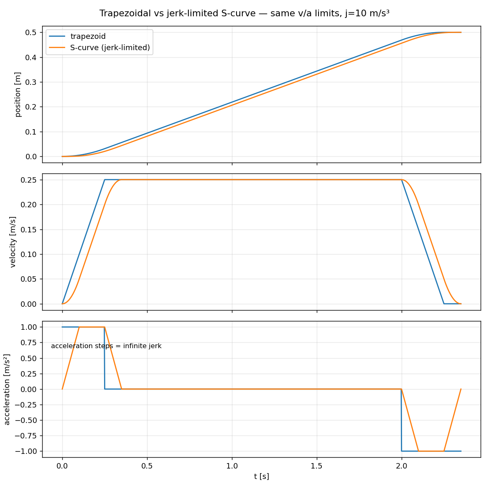

# trajectory-lab

Motion-control fundamentals implemented from scratch in C++20: the building
blocks under any industrial robot trajectory stack.



## What's here

| Component | File | What it shows |
|---|---|---|
| Trapezoidal profile | `include/trajlib/trapezoidal.hpp` | rest-to-rest, trapezoid/triangle case split |
| 7-phase S-curve | `include/trajlib/scurve.hpp` | jerk-limited, full case tree (a_max / v_max reachable or not), analytic constant-jerk segment integration |
| Parabolic via-point blend | `include/trajlib/blend.hpp` | LSPB corner rounding; corner deviation = \|v2−v1\|·t_b/8, verified by test |
| SPSC lock-free ring | `include/trajlib/spsc_ring.hpp` | acquire/release publication, false-sharing padding — the RT↔non-RT handoff |
| 500 Hz setpoint streamer | `src/stream_demo.cpp` | absolute deadlines, jitter measurement, SCHED_FIFO attempt — the UR servoj / Fanuc Stream Motion shape |

## Build & test

```sh
cmake -B build && cmake --build build -j
ctest --test-dir build --output-on-failure   # 20 cases, ~113k assertions
./build/stream_demo                           # prints max tick jitter + overruns
./build/profile_demo > out.csv && python3 scripts/plot_profiles.py out.csv
```

CI runs the suite under ASan/UBSan and TSan (`.github/workflows/ci.yml`).

## Design notes

- Profiles are immutable after construction and sampled by absolute time —
  stateless `sample(t)` makes them trivially safe to call from an RT thread
  and to re-target (replan from sampled state).
- The S-curve derives phase *durations* from the case tree, then integrates
  constant-jerk segments analytically; the segment list is the single source
  of truth, so phase-boundary continuity holds by construction.
- No allocation after construction anywhere on the sampling/streaming path.

Study companions: Biagiotti & Melchiorri, *Trajectory Planning for Automatic
Machines and Robots* ch. 3; [Ruckig](https://github.com/pantor/ruckig) for the
online time-optimal generalization of these profiles.
